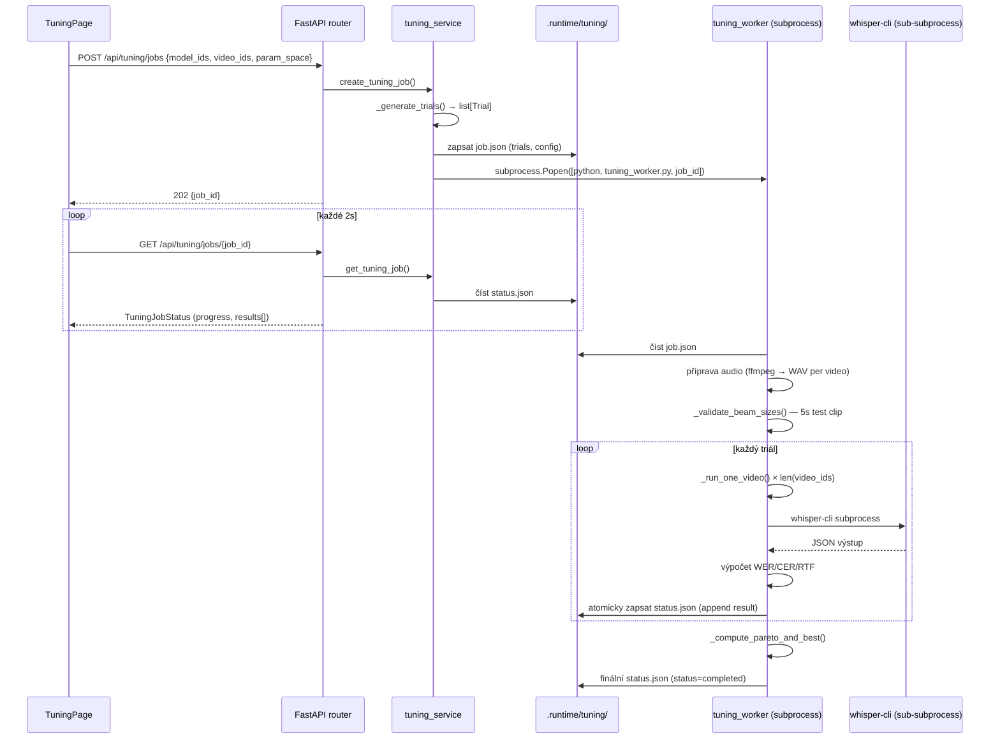
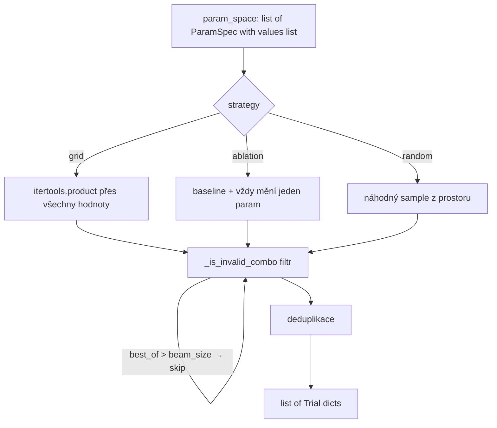

# Tuning systém — architektura a logika
**Datum:** 2026-03-26
**Verze kódu:** feature/tuning-v2
**Autor:** Claude Sonnet 4.6 (generováno ze session 48bb4468)

---

## Obsah

1. [Co je tuning a proč existuje](#1-co-je-tuning-a-proč-existuje)
2. [Vysokoúrovňová architektura komponent](#2-vysokoúrovňová-architektura-komponent)
3. [Životní cyklus tuning jobu](#3-životní-cyklus-tuning-jobu)
4. [Generování triálů (parametrický prostor)](#4-generování-triálů-parametrický-prostor)
5. [Zpracování jednoho triálu](#5-zpracování-jednoho-triálu)
6. [Zpracování jednoho videa v triálu](#6-zpracování-jednoho-videa-v-triálu)
7. [Diskové soubory a komunikace worker ↔ backend](#7-diskové-soubory-a-komunikace-worker--backend)
8. [Klíčová designová rozhodnutí](#8-klíčová-designová-rozhodnutí)
9. [Známé limitace a technický dluh](#9-známé-limitace-a-technický-dluh)

---

## 1. Co je tuning a proč existuje

Tuning hledá **optimální hyperparametry** pro daný STT model — kombinaci `beam_size`, `best_of`, `threads`, `language` atd., která minimalizuje WER (Word Error Rate) při zachování RTF < 1.0 (model stíhá přepisovat v reálném čase).

**Vstup:** model_id(s), seznam video_ids, rozsahy parametrů
**Výstup:** tabulka triálů s WER/CER/RTF pro každou kombinaci, Pareto-optimální sada, doporučení best_trial

Tuning je de facto **grid search / ablation / random search** přes parametrický prostor, kde každý bod (triál) = jeden benchmark run na vybraných videích.

---

## 2. Vysokoúrovňová architektura komponent

```mermaid
graph TD
    subgraph "Frontend (React)"
        TP[TuningPage.tsx]
        TP -->|POST /api/tuning/jobs| API
        TP -->|GET /api/tuning/jobs/:id poll 2s| API
    end

    subgraph "Backend (FastAPI :8012)"
        API[routers/tuning.py]
        API --> SVC[services/tuning_service.py]
        SVC -->|generuje triály| TRIALS[(trial list)]
        SVC -->|zapíše job.json| DISK1[.runtime/tuning/job_id/job.json]
        SVC -->|spustí subprocess| WORKER
    end

    subgraph "Worker subprocess (scripts/tuning_worker.py)"
        WORKER[main()]
        WORKER -->|čte| DISK1
        WORKER -->|příprava audio cache| AUDIO[.runtime/tuning/job_id/audio/]
        WORKER -->|validace beam_size| VBEAM[_validate_beam_sizes]
        WORKER -->|iteruje triály| TRIAL_LOOP[trial loop]
        TRIAL_LOOP -->|per video| VID[_run_one_video]
        VID --> RUNNER[streaming_runner._run_buffered]
        RUNNER -->|subprocess| WHISPER[whisper-cli.exe]
        WORKER -->|každý update| STATUS[.runtime/tuning/job_id/status.json]
    end

    subgraph "Packages"
        RUNNER
        WHISPER
    end

    API -->|čte status.json| STATUS
    STATUS -->|polling| TP
```

**Vrstvy (shora dolů):**
| Vrstva | Soubor | Zodpovědnost |
|--------|--------|--------------|
| UI | `frontend/src/pages/TuningPage.tsx` | formulář, live progress, výsledková tabulka |
| API router | `backend/app/routers/tuning.py` | HTTP endpointy, validace requestu |
| Service | `backend/app/services/tuning_service.py` | generování triálů, spouštění workeru, čtení status.json |
| Worker | `scripts/tuning_worker.py` | hlavní smyčka, audio příprava, beam validace, psaní výsledků |
| Runner | `packages/benchmarks/runners/streaming_runner.py` | `_run_buffered()` — batched přepis |
| Adapter | `packages/adapters/whisper_cpp_runner.py` | spuštění whisper-cli, parsování JSON výstupu |
| Binary | `whisper-cli.exe` | samotný přepis |

---

## 3. Životní cyklus tuning jobu



**Stavy jobu:**
```
pending → running → completed
                 ↘ failed
                 ↘ cancelled  (na požádání UI → cancel flag v job.json)
```

---

## 4. Generování triálů (parametrický prostor)



**Příklad param_space (whisper_cpp):**
```json
[
  {"name": "beam_size", "values": [1, 3, 5]},
  {"name": "best_of",   "values": [1, 3, 5]},
  {"name": "threads",   "values": [4, 8]},
  {"name": "chunk_seconds", "values": [30]}
]
```
→ grid: 3×3×2×1 = 18 kombinací, po filtraci `best_of > beam_size` → ~12 validních triálů

**`_is_invalid_combo()`** v `tuning_service.py`:
- `best_of > beam_size` → nevalidní (whisper-cli behavior undefined)

**`chunk_seconds`** je ghost parameter pro `whisper_cpp` — do param_space se přidá fixně jako `[30]` a neovlivňuje výsledky (whisper_cpp používá `_run_buffered`, ne streaming).

---

## 5. Zpracování jednoho triálu

```mermaid
flowchart TD
    START([triál č. N]) --> CANCEL{cancel_flag?}
    CANCEL -->|ano| ABORT([status = cancelled])
    CANCEL -->|ne| BEAM_CHECK{beam_size v triálu?}
    BEAM_CHECK -->|ano| VALIDATED{"(model_id, beam_size)\nv validated_pairs?"}
    VALIDATED -->|ne → validace selhala| SKIP_TRIAL[přeskočit, error = beam_size_rejected]
    VALIDATED -->|ano| RUN_VIDEOS
    BEAM_CHECK -->|ne| RUN_VIDEOS

    RUN_VIDEOS[_run_one_video × len(video_ids)]
    RUN_VIDEOS --> AGG[agregace WER/RTF přes videa]
    AGG --> RTF_VIABLE["rtf_viable = avg_rtf < 1.0"]
    AGG --> PERCEIVED["perceived_delay_s = sample_seconds × (1 + avg_rtf)"]
    AGG --> APPEND[_append_result → status.json atomicky]
    APPEND --> STATUS_UPDATE[zapsat progress, updated_ts]
    STATUS_UPDATE --> NEXT([triál č. N+1])
```

**Atomický zápis `_append_result()`:**
1. Přečti aktuální `status.json`
2. Append nový result do `results[]`
3. Zapiš do temp souboru `.status.tmp`
4. `os.replace(tmp, status.json)` — atomická operace na Windows/Linux
5. Při chybě retry 3× s exponential backoff

---

## 6. Zpracování jednoho videa v triálu

```mermaid
flowchart TD
    START([_run_one_video]) --> WAV_CACHE{"audio_cache/\nvideo_id.wav existuje?"}
    WAV_CACHE -->|ne| FFMPEG[ffmpeg: stáhni+konvertuj do WAV 16kHz mono]
    FFMPEG --> WAV_FILE[audio_cache/video_id.wav]
    WAV_CACHE -->|ano| WAV_FILE

    WAV_FILE --> CLIP_CALC["clip_start = seed → deterministický offset\nclip_end = clip_start + sample_seconds"]
    CLIP_CALC --> WAV_DURATION["čti skutečnou délku WAV\n(wave.open → nframes/framerate)"]
    WAV_DURATION --> REF_TEXT["extract_vtt_clip_text(\n  clip_start_s,\n  clip_end_s = clip_start + min(actual_audio_s, sample_seconds)\n)"]

    REF_TEXT --> CONFIG[StreamingRunConfig(\n  source_wav_path=wav_file,\n  clip_start=clip_start,\n  sample_seconds=sample_seconds,\n  ...\n)]
    CONFIG --> RUNNER["streaming_runner.run_benchmark_source()\n→ _run_buffered()"]
    RUNNER --> WHISPER["whisper-cli.exe\n-m model -f wav -l cs\n-ot offset -d duration\n-bs beam_size -bo best_of\n-oj -otxt -of base -np"]
    WHISPER --> JSON_OUT[ggml output .json]
    JSON_OUT --> PARSE["WER = jiwer(ref_text, transcript)\nRTF = elapsed / audio_duration"]
    PARSE --> RETURN([dict: wer, cer, rtf, latency_ms, transcript, ...])
```

**Klíčový detail — `source_wav_path`:**
Worker předá hotový WAV soubor přímo do runneru. Runner (`_run_buffered`) přeskočí generator loop a použije soubor přímo. Eliminuje dvojitou konverzi int16→float32→int16.

**Správné reference okno:**
```python
actual_audio_s = wave.getnframes() / wave.getframerate()
clip_end_s = clip_start_s + min(actual_audio_s, float(sample_seconds))
ref_text = extract_vtt_clip_text(clip_start_s, clip_end_s, ...)
```
Bez `min(actual_audio_s, ...)` by reference obsahovala slova z audio úseku, který whisper nikdy neuslyšel → nafouklé WER.

---

## 7. Diskové soubory a komunikace worker ↔ backend

```
.runtime/
└── tuning/
    └── {job_id}/
        ├── job.json          ← tuning_service zapíše před spuštěním workeru
        │                        obsah: {trials, model_ids, video_ids, sample_seconds,
        │                                clip_seed, param_space, cancel_flag}
        ├── status.json       ← worker zapisuje atomicky na každý update
        │                        obsah: {status, progress_message, completed_trials,
        │                                total_trials, results[], best_trial_idx,
        │                                audio_ready[], updated_ts, error}
        └── audio_cache/
            ├── {video_id}.wav         ← ffmpeg konverze (16kHz, mono, int16)
            └── {video_id}_whisper/    ← dočasné whisper výstupy (*.json, *.txt)
```

**`job.json` — jednosměrná komunikace backend → worker:**
- Worker čte na začátku pro konfiguraci
- Worker čte `cancel_flag` periodicky (jednoduchý IPC bez pipe)

**`status.json` — jednosměrná komunikace worker → backend:**
- Worker zapisuje, backend čte
- Atomický zápis přes `os.replace(tmp, target)`
- Backend service `get_tuning_job()` čte a parsuje do `TuningJobStatus` Pydantic modelu
- Frontend polluje každé 2s přes GET endpoint

**`updated_ts` — detekce zaseknutého workeru:**
- Worker zapíše `updated_ts = datetime.utcnow().isoformat()` na každý progress update
- Frontend může počítat `age = Date.now() - new Date(updated_ts)`
- Pokud age > 120s a status = running → worker pravděpodobně zamrzl

---

## 8. Klíčová designová rozhodnutí

| Rozhodnutí | Varianta A (zvolená) | Varianta B (odmítnuta) | Důvod |
|-----------|---------------------|----------------------|-------|
| **Worker isolace** | Samostatný subprocess | Thread v backendu | Crash whisper-cli nezabije backend; přesné CPU/RAM měření jen pro STT |
| **IPC worker ↔ backend** | Soubory (job.json, status.json) | Pipe / queue | Jednoduchý, auditovatelný, bez deadlock rizika; soubory přežijí restart |
| **Atomický zápis** | `os.replace(tmp→target)` | Přímý zápis | Backend nikdy nečte napůl zapsaný soubor |
| **Audio příprava** | Jeden WAV soubor, znovu použitý | Překonvertovat před každým triálem | Každý triál na stejném videu použije stejné audio → fair porovnání |
| **Beam validace** | 5s pre-flight test per (model_id, beam_size) | Timeout za runtime | beam_size=5 crashuje whisper na určitých audiích; pre-flight to odchytí levně |
| **proc.communicate()** | `communicate(timeout=T)` | `wait(timeout) + communicate()` | `wait()` s piped stdout/stderr deadlockuje při plném pipe bufferu (64 KB) |
| **CPU idle detection** | Monitor thread, kill po 30s < 1% CPU | Timeout pouze | Odchytí silent hangy kde whisper nepadne, ale nepracuje |
| **RTF viable** | Computed per trial, immediately | Jen na konci jobu | Frontend zobrazuje ✓/✗ ihned při live progress |
| **Pareto excludes errors** | `r.get("error") is None` | Include all non-None WER | Partiální WER z chybového přepisu by zkreslovalo Pareto frontu |
| **perceived_delay_s** | `sample_seconds × (1 + avg_rtf)` | `chunk_seconds × (1 + RTF)` | chunk_seconds je ghost param; sample_seconds = délka skutečně přepsaného audia |

---

## 9. Známé limitace a technický dluh

### 9.1 Ghost parameter `chunk_seconds` pro whisper_cpp
`whisper_cpp` používá `_run_buffered()` (batch zpracování celého klipu), nikoli streaming.
`chunk_seconds` nemá žádný vliv na WER ani RTF pro tento adapter.
**Workaround:** `chunk_seconds` je fixně nastaven na `[30]` v tuning_service, odstraněn z UI WHISPER_PARAM_DEFS.
**Správné řešení:** Adapter-specifické param defs, které filtrují irelevantní parametry.

### 9.2 Pareto nekonzistence worker vs backend
- **Worker (`_compute_pareto_and_best`)**: excluduje triály kde `error is not None`
- **Backend (`_mark_pareto`)**: includuje všechny triály kde `wer is not None` (error triály s parciálním WER)
- **Dopad:** Live Pareto frontier (při polling) se mírně liší od finálního (po dokončení jobu)

### 9.3 best_idx lookup (opraveno v tuning-v2)
Původně: `results[best_idx]` — `best_idx` je `trial_idx`, ne list index. Fungovalo náhodou, protože triály jsou appendovány v pořadí.
Opraveno: `next((r for r in results if r["trial_idx"] == best_idx), None)`

### 9.4 WER reference window (opraveno v tuning-v2)
Původně: `clip_end_s = clip_start_s + sample_seconds` — nafouklé WER pokud WAV kratší než sample_seconds.
Opraveno: `clip_end_s = clip_start_s + min(actual_audio_s, sample_seconds)` kde `actual_audio_s` z WAV header.

### 9.5 perceived_delay_s kalkulace (opraveno v tuning-v2)
Původně: `chunk_seconds * (1 + RTF)` — smysluplné jen pro streaming adaptery.
Opraveno: `sample_seconds * (1 + avg_rtf)` — proxy pro "jak dlouho uživatel čeká na přepis klipu".

### 9.6 Validace beam_size per model (opraveno v tuning-v2)
Původně: validace probíhala jen s `job.model_id` (první model).
Opraveno: `set[tuple[str, int]]` — každý `(model_id, beam_size)` testován samostatně.

### 9.7 sleep(0.1) overhead (opraveno v tuning-v2)
`streaming_runner._run_buffered()` mělo unconditional `time.sleep(0.1)` v heartbeat smyčce.
Pro 480-trial job = 1440 iterací × 0.1s = 144s zbytečného čekání.
Opraveno: `if config.transcript_callback is not None:` — sleep jen pokud někdo poslouchá.

### 9.8 Chybí persistent cancel přes restart
`cancel_flag` je v `job.json`. Pokud backend restartuje po odeslání cancel, ale před přečtením workerem → worker pokračuje.
Nízká priorita (backend restart během tuning jobu je extrémně vzácný).

---

*Dokument vygenerován automaticky ze session analýzy 2026-03-26.*
*Diagramy: Mermaid (kompatibilní s GitHub, Obsidian, VS Code Markdown Preview Enhanced)*
