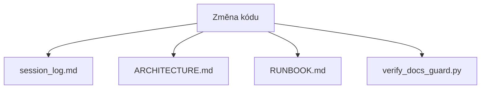

# Recovered Conversation (2026-04-01)

- Source session: 019d493a-66af-7401-a0b6-5551933d6c4f
- Source file: C:\Users\adamf\.codex\sessions\2026\04\01\rollout-2026-04-01T15-27-37-019d493a-66af-7401-a0b6-5551933d6c4f.jsonl
- Exported at: 2026-04-01 22:01:09 +02:00

## User (04/01/2026 13:28:18)

# AGENTS.md instructions for c:\Users\adamf\OneDrive\Dokumenty\aSTT-comp

<INSTRUCTIONS>
Nedomnívej se ale analyzuj. 
Preferuj kódování v souladu s best practice.

--- project-doc ---

# aSTT-comp — projekt kontext pro Codex

## Proč tento projekt existuje
Čistý přepis `aSTT-comparison` (organicky narostlý, monolitický) do nové struktury.
Původní: main.py 3224 řádků, index.html 7178 řádků — nešlo udržovat.

## Cíl aplikace
Kriticky změřit a ohodnotit různé STT modely pro **online přepis češtiny** (a později dalších jazyků).

**Klíčový požadavek: měření simuluje živý rozhovor, ne dávkové zpracování záznamu.**
- Audio je posíláno do STT modelu v real-time chuncích (100–200ms) jako z mikrofonu
- Model musí stíhat přepisovat jak audio přichází (RTF < 1.0 = stíhá, RTF > 1.0 = nestíhá)
- Tím testujeme skutečnou použitelnost pro live dialog, ne jen offline přesnost

Vstup: YouTube videa s `cs` titulky (ground truth)
Výstup: WER/CER, latence, RTF, HW nároky pro každý model × nastavení × video

## Tech stack
- **Backend:** FastAPI + uvicorn na `127.0.0.1:8012`, Pydantic v2
- **Frontend:** React 18 + Vite + TypeScript + TailwindCSS + TanStack Table + Recharts
- **Packages:** zkopírovány z aSTT-comparison (benchmarks, adapters, ingest)
- **Soubory:** bez přísného limitu řádků — každý soubor = jedna zodpovědnost, přehledný na první přečtení

## Jazykové Kódy (Důležité)
- Čeština se v projektu značí výhradně `cs` (ISO 639-1).
- Regionální zápis může být `cs-CZ` (jazyk + země).

## Kategorie STT Modelů
- `whisper_cpp`: whisper.cpp modely (offline, mic režim dostupný dle konkrétního modelu).
- `faster_whisper`: CTranslate2 streaming modely (streaming + mic).
- `vosk`: lehké streaming modely (streaming + mic, nízké HW nároky).
- `sherpa_onnx`: ONNX streaming modely (streaming + mic, jazyk dle bundle).
- `qwen_asr`: LLM ASR modely (offline/dávkové, bez live mic režimu).
- `moonshine`: moderní streaming model (aktuálně EN).

## Adresářová struktura
```
aSTT-comp/
├── backend/
│   ├── app/
│   │   ├── config.py
│   │   ├── main.py
│   │   ├── models/            # library.py, benchmark.py, runs.py
│   │   ├── routers/           # health, library, benchmark, runs
│   │   └── services/          # library_service, benchmark_service, results_service
│   └── requirements.txt
├── packages/
│   ├── benchmarks/
│   │   ├── runners/           # matrix_benchmark_runner.py, host_telemetry.py
│   │   ├── metrics/           # text_metrics.py (WER/CER + diff)
│   │   └── ground_truth/
│   │       ├── reference_manifest.py
│   │       └── vtt_reference.py
│   ├── adapters/              # whisper_cpp, sherpa_onnx, vosk, qwen_asr
│   └── ingest/                # source_resolver, yt_dlp_fetcher
├── scripts/                   # volatelné skripty pro testy a utility
│   ├── check_health.py        # ověří backend
│   ├── check_model.py         # test připravenosti konkrétního modelu
│   ├── preflight.py           # HW podmínky před benchmarkem
│   ├── copy_subtitles.py      # zkopíruje VTT ze starého projektu
│   └── run_benchmark.py       # CLI spuštění benchmarku
├── docs/
│   ├── plan.md                # kompletní specifikace (tento soubor)
│   ├── models/                # log instalací/odinstalací modelů
│   └── runs/                  # auto-generovaná dokumentace každého runu
└── .runtime/
    ├── library/items.json
    ├── library/subtitles/{video_id}/*.vtt
    ├── library/results/{video_id}/{model}__{setting}/
    ├── runs/{run_id}/
    └── jobs/{job_id}/
```

## API endpointy
- `GET /api/health`
- `GET/POST /api/library/items`
- `POST /api/library/download-subtitles`
- `GET /api/library/subtitle/{video_id}/{filename}`
- `GET /api/library/latest-results/{video_id}`
- `POST /api/benchmark/jobs` → 202 async
- `GET /api/benchmark/jobs`, `GET /api/benchmark/jobs/{job_id}`
- `POST /api/benchmark/jobs/{job_id}/cancel`
- `GET /api/benchmark/options`
- `GET /api/runs`, `GET /api/runs/{run_id}`
- `GET /api/models` — přehled instalovaných modelů + log
- `POST /api/models/{model_id}/install`, `DELETE /api/models/{model_id}`

## Fáze implementace

### Fáze 1 ✅ Scaffold
Skeleton souborů, config, main, modely, routery, services kostra.

### Fáze 2 🔄 Library + VTT
- library_service.py (CRUD, download titulků) — EXISTS, verify
- vtt_reference.py (85 řádků) — EXISTS
- results_service.py — EXISTS, verify
- Spustit backend, otestovat endpointy

### Fáze 3 ⏳ Benchmark pipeline (subprocess izolace)
- Každý STT run běží v **izolovaném podprocesu** (ne ve vlákně backendu)
  - Proč: crash modelu (qwen bfloat16) nezabije backend
  - Proč: přesné CPU/RAM měření jen pro STT proces (ne celý backend)
  - Proč: možnost kill/timeout bez vedlejších efektů
- Audio se posílá v real-time chuncích (streaming simulace živého rozhovoru)
- benchmark_service.py → spustí worker subprocess → monitoruje psutil
- progress_callback přes soubor nebo pipe (ne threading)
- HW telemetrie: 2× pre-sample + 2× post-sample s 2s intervaly

### Fáze 4 ⏳ Frontend React
Tři hlavní obrazovky:

**1. Knihovna (`/library`)**
- Tabulka videí, inline benchmark výsledky (WER/CER per model)
- Akce: přidat video, stáhnout titulky, spustit benchmark pro video

**2. Benchmark (`/benchmark`)**
- Výběr videí + modelů + nastavení + scénáře
- Spuštění → progress bar s live stavem
- Během runu: video přehrávač + live přepis + live metriky + HW grafy
- Po dokončení: WER diff (kde model chyboval), shrnutí

**3. Výsledky (`/results`)**
- Tabulka: videa × modely, hodnoty = WER/CER
- Scatter grafy: kvalita vs latence, RAM vs WER
- Doporučení Top 3 s odůvodněním

## Klíčová funkce: VTT → automatický ground truth
`packages/benchmarks/ground_truth/vtt_reference.py`:
- `extract_vtt_clip_text(video_id, clip_start_s, clip_end_s, subtitles_root)` → str|None

## Scénáře (reprodukovatelnost)
Uložené JSON konfigurace benchmarku. Stejný scénář = stejné podmínky = srovnatelné výsledky.
```json
{
  "scenario_id": "cs_dialog_120s_seed42",
  "clip_seconds": 120,
  "clip_seed": 42,
  "models": ["whisper_cpp_small"],
  "settings": ["balanced"],
  "videos": ["R3BsjbDtWrY", "SQRKerJ22zw"]
}
```

## HW měření a podmínky
- 2× pre-sample (před startem), 2× post-sample (po dokončení), 2s interval
- `conditions_clean: true/false` — detekce zda jiné procesy zatěžovaly CPU > 20%
- CPU teplota (throttling detection)
- Clock audit: drift wall vs monotonic > 2s = varování
- Upozornění pokud systém není "čistý" před spuštěním

## Modely — log instalací
`docs/models/{model_id}.json`:
```json
{
  "model_id": "whisper_cpp_small",
  "events": [
    {"type": "install", "date": "2026-03-15T14:32:00Z", "version": "v1.5.4", "size_mb": 461},
    {"type": "uninstall", "date": "...", "reason": "..."}
  ]
}
```

## Scripts — volatelné testy
```bash
python scripts/check_health.py              # backend alive?
python scripts/check_model.py whisper_cpp_small   # model ready?
python scripts/preflight.py                # HW podmínky OK?
python scripts/copy_subtitles.py           # kopíruj VTT ze starého projektu
python scripts/run_benchmark.py --scenario cs_dialog_120s_seed42
```

## Automatická dokumentace runů
Po každém benchmarku se auto-generuje `docs/runs/{run_id}/README.md`:
- parametry runu, scénář, podmínky HW, výsledky per model, WER diff, datum

## Testování
```bash
# unit testy
.venv\Scripts\python -m pytest tests/ -v

# smoke testy (bez modelů)
python scripts/check_health.py
python scripts/preflight.py

# integration test konkrétního modelu
python scripts/check_model.py whisper_cpp_small
```

## Spuštění backendu
Projekt má vlastní .venv (Python 3.13):
```bash
cd C:\Users\adamf\OneDrive\Dokumenty\aSTT-comp
.venv\Scripts\python -m uvicorn backend.app.main:app --host 127.0.0.1 --port 8012 --reload
```

## Spuštění testů
```bash
cd C:\Users\adamf\OneDrive\Dokumenty\aSTT-comp
.venv\Scripts\python -m pytest tests/ -v
```

## Testovací videa (6 videí s `cs` titulky)
| video_id | Název | Délka |
|---|---|---|
| R3BsjbDtWrY | PlayStation VR2 Tech rozhovor | 143s |
| SQRKerJ22zw | Rozhovor s Capsem z G2 Esports | 286s |
| QyKlQLkaH0s | Rozhovor s Kaiserem z MAD Lions | 305s |
| s9F5qXVK4uU | Mezinárodní den autismu – rozhovor | 548s |
| 3_sujNKFpPU | Cukrfree Podcast #24 (nejdelší!) | 2956s |
| t9j-7JxuZVU | Rozhovor s vývojářem Cyberpunk 2077 | 559s |

Titulky jsou staženy ve starém projektu:
`C:\Users\adamf\OneDrive\Dokumenty\aSTT-comparison\.runtime\source_library\subtitles\{video_id}\`

## Poučení z aSTT-comparison
- Soubory: jedna zodpovědnost, přehledné — ne monolitické
- Frontend: React komponenty, ne jeden HTML soubor
- Qwen na Windows: vždy float32, nikdy bfloat16 (nativní crash)
- sherpa_onnx: optional, ne blokující dependency
- Git: commity průběžně, push nikdy bez souhlasu
- AGENTS.md + CONTRIBUTING.md + docs/PLAN_TRACKER.md + docs/session_log.md: aktualizovat na konci každé session

</INSTRUCTIONS>

<environment_context>
  <cwd>c:\Users\adamf\OneDrive\Dokumenty\aSTT-comp</cwd>
  <shell>powershell</shell>
  <current_date>2026-04-01</current_date>
  <timezone>Europe/Prague</timezone>
</environment_context>

---

## User (04/01/2026 13:28:18)

přečti si: 
"C:\Users\adamf\OneDrive\Dokumenty\aSTT-comp\docs\doc_audit_2026-04-01.md"
a stručně!!! kriticky zhodnoť obsah


---

## Assistant (04/01/2026 13:28:23)

Přečtu `docs/doc_audit_2026-04-01.md` a dám stručné, kritické hodnocení obsahu se zaměřením na konkrétní slabiny a rizika. Teď nejdřív načtu celý dokument.

---

## Assistant (04/01/2026 13:28:42)

Audit v [doc_audit_2026-04-01.md](/c:/Users/adamf/OneDrive/Dokumenty/aSTT-comp/docs/doc_audit_2026-04-01.md) je užitečný jako rychlá diagnostika, ale metodicky je neúplný.

- Plus: správně trefuje největší rizika (neexistující referenční docs, zastaralý tracker, chybějící session log).
- Mínus: část tvrzení je bez ověření/důkazu přímo v textu (např. „desítky změn“, „přepis je hotový“).
- Mínus: chybí prioritizovaný akční plán (owner, deadline, pořadí kroků), takže audit není dobře vykonatelný.
- Mínus: závažnosti jsou uvedené, ale bez dopadové metriky (co blokuje release/provoz hned vs. později).

Verdikt: obsah je věcný a kritický, ale spíš „alarm report“ než akční governance dokument.

---

## User (04/01/2026 13:30:58)

napiš stručnou analýzu co s tím: 
(stručný plán: co je v kontextu dokumentace potřeba opravit, dodělat, smazat ... ?)


---

## Assistant (04/01/2026 13:31:17)

**Stručný plán (dokumentace)**

1. `P0: Sjednotit zdroj pravdy`
- Nechat jen jeden hlavní instrukční soubor (`AGENTS.md`), `CLAUDE.md` zrušit nebo změnit na krátký odkaz.
- V `CONTRIBUTING.md` sjednotit formulaci push pravidla na jednu verzi.

2. `P0: Opravit rozbité odkazy a minimální kostru`
- Vytvořit chybějící `README.md`, `ARCHITECTURE.md`, `RUNBOOK.md` (i krátké verze).
- Opravit v `CONTRIBUTING.md` všechny odkazy tak, aby vedly na existující soubory.

3. `P0: Aktualizovat realitu projektu`
- Přepsat `docs/PLAN_TRACKER.md` podle aktuálního stavu (co je hotovo, co běží, co blokuje).
- Doplnit do `docs/session_log.md` chybějící záznamy z posledních session.

4. `P1: Doplnit chybějící provozní pravidla`
- Explicitně zapsat „fyzický browser smoke test před commitem“ + kdy je výjimka.
- Přidat krátká pravidla pro refactoring/code review (kdy refaktorovat, kdy ne).

5. `P1: Uklidit zastaralé materiály`
- Staré `tuning_v4_*` dokumenty buď archivovat (`docs/archive/`), nebo označit jako neaktuální.
- V aktivních dokumentech odstranit neplatná tvrzení a staré fáze.

6. `P2: Zavést údržbový rytmus`
- Přidat „Start checklist“ a „End checklist“ pro každou session.
- U `PLAN_TRACKER.md` přidat datum poslední revize a odpovědnost (owner).

Cíl: mít do 1 průchodu dokumentací konzistentní, aktuální a vykonatelný systém bez duplicit a mrtvých odkazů.

---

## User (04/01/2026 13:33:22)

Jak nebo lze vůbec vysvětlit všem modelům LLM kde vždy musí začít? 
Jak nastavit automatický systém který nikdy nedopustí rozpadu a zastarání dokumentace? 


---

## Assistant (04/01/2026 13:34:03)

Krátká odpověď: 100% „nikdy“ u LLM nezajistíš jen instrukcí. Zajistíš to pouze kombinací instrukcí + tvrdých kontrol v CI.

Praktický model:

1. Jeden vstupní bod pro všechny modely  
`AGENTS.md` = jediný autoritativní soubor. `CLAUDE.md` buď smaž, nebo jen 3 řádky s odkazem na `AGENTS.md`.

2. Pevný start kontrakt  
Do `AGENTS.md` dej explicitní pořadí startu: `AGENTS.md -> PLAN_TRACKER.md -> session_log.md -> task`.  
Bez splnění kontraktu se nesmí commitnout.

3. Strojově čitelné metainformace  
Každý klíčový doc má `last_updated`, `owner`, `status` (active/deprecated).  
Zastaralé docs se přesouvají do `docs/archive/`.

4. CI „fail-closed“ guard  
Workflow musí failnout PR, když:  
- jsou změny v kódu a žádná změna v povinných docs,  
- je rozbitý odkaz nebo chybí referencovaný soubor,  
- `session_log.md` nemá nový záznam,  
- `PLAN_TRACKER.md` není aktualizovaný při změně scope.

5. PR template + Definition of Done  
Povinné checkboxy: docs updated, session log updated, runbook/architecture touched if relevant.

6. Periodický audit bot  
1x týdně automaticky otevře issue pro docs s `last_updated` starším než např. 14 dní.

Klíč: nespoléhat na „model si vzpomene“, ale na systém, který bez aktuální dokumentace nepustí změnu dál.

---

## User (04/01/2026 13:36:39)

1. Budou toto respektovat všechny LLM? Nebo co bude pro vždy pro všechny nepřekročitelný bod? 
AGENTS.md = jediný autoritativní soubor. CLAUDE.md buď smaž, nebo jen 3 řádky s odkazem na AGENTS.md.


---

## Assistant (04/01/2026 13:37:02)

Ne. **Všechny LLM to samy od sebe respektovat nebudou**.

`AGENTS.md` jako jediný autoritativní soubor je správně, ale je to jen pravidlo.  
**Nepřekročitelný bod** je až tento technický gate:

1. `main` chráněná větev: žádný direct push, žádný force push, žádný admin bypass.
2. Merge jen přes PR.
3. Povinné CI checky (`required`): `docs_guard` musí projít.
4. `CODEOWNERS` pro dokumentaci: bez schválení odpovědné osoby se nemerguje.

Prakticky:
- `CLAUDE.md` buď smaž, nebo nechej jen stub s odkazem na `AGENTS.md`.
- V CI vynucuj, že `CLAUDE.md` má přesně tento stub (nebo neexistuje).
- CI fail při rozbitých odkazech / chybějících docs updatech.

Takže: **LLM nelze donutit instrukcí, ale lze je donutit procesem, který bez splnění pravidel nepustí merge.**

---

## User (04/01/2026 13:41:57)

jak si psal: 
Praktický model:

1. Jeden vstupní bod pro všechny modely ... 

Udělej tedy backup současné dokumentace a Navrhni v kontextu současné dokumentace a projektu nápravu dokumentace ... a všeho co je potřeba napravit. 
Jak zajistit aby pokaždé když má 101% proběhla stručná aktualizace. 
Aby soubory obsahovaly všechny náležitosti co mají (třeba včetně správného timestamp ...) ve struktuře která nejde obejít ... ? 


---

## Assistant (04/01/2026 13:42:07)

Rozumím: udělám nejdřív bezpečný backup aktuální dokumentace a potom v projektu zavedu konkrétní, vynutitelný systém, který bude hlídat povinné aktualizace docs včetně timestampů. Teď projdu aktuální stav souborů v `docs/` a repozitáři, a pak připravím implementaci.

---

## Assistant (04/01/2026 13:42:16)

Našel jsem, že `README.md`, `AGENTS.md`, `CLAUDE.md`, `CONTRIBUTING.md`, `docs/ARCHITECTURE.md`, `docs/RUNBOOK.md` už existují a je tu i `scripts/verify_docs_guard.py`. Teď ověřím jejich reálný obsah a navrhnu/implementuji systém tak, aby to nebylo jen formálně přítomné, ale skutečně vynutitelné.

---

## Assistant (04/01/2026 13:42:30)

Teď načtu hlavní interní docs a existující `docs_guard` skript/workflow, abych navrhl nápravu tak, aby byla vynutitelná přes CI a nešlo ji obcházet.

---

## Assistant (04/01/2026 13:43:23)

Mám dost kontextu a jdu to udělat end-to-end, ne jen návrh.  
Plán implementace:

1. Vytvořím snapshot backup aktuální dokumentace do timestampované složky v `docs/backups/`.
2. Zavedu jednotný „docs contract“: jeden autoritativní vstup (`AGENTS.md`), `CLAUDE.md` jako stub, povinné metadata v klíčových dokumentech (`Owner`, `Status`, `Last updated`, `Review by`).
3. Rozšířím `scripts/verify_docs_guard.py`, aby kromě „soubor byl změněn“ kontroloval i strukturu a timestamp metadata v povinných docs.
4. Přidám helper skript na rychlé a stručné session zápisy s automatickým UTC timestampem, aby aktualizace byla jednoduchá a opakovatelná.
5. Doplním CI workflow a `CODEOWNERS` tak, aby se to v PR nedalo obejít bez průchodu guardem a review.
6. Aktualizuji dokumenty (`CONTRIBUTING`, `PLAN_TRACKER`, `session_log`, `ARCHITECTURE`, `RUNBOOK`, `README`) na novou smlouvu.

Teď nejdřív provedu backup, pak začnu editace.

---

## Assistant (04/01/2026 13:46:54)

Backup příkaz narazil na problém, protože při kopii celé složky `docs` do `docs/backups/...` se začala rekurzivně kopírovat i cílová složka. Teď to opravím: smažu vadný pokus a udělám čistý backup jen vybraných souborů mimo rekurzi.

---

## Assistant (04/01/2026 13:47:13)

Vadný pokus vytvořil přebujelý rekurzivní obsah v `docs/backups` (desítky tisíc souborů). Teď odstraním jen ty dvě chybné backup složky a vytvořím nový, korektní snapshot bez rekurze.

---

## Assistant (04/01/2026 13:50:23)

Začínám editace: zavedu jednotný metadata blok do klíčových dokumentů, převedu `CLAUDE.md` na stub, přidám governance dokument a posílím `docs_guard` skript o kontroly struktury/timestampů. Následně doplním auto-skript na stručný session zápis s UTC timestampem.

---

## Assistant (04/01/2026 13:54:19)

Teď přepisuji `scripts/verify_docs_guard.py`, aby kromě mapování změn hlídal i povinný `Doc-Meta` blok, formát UTC timestampu a přítomnost nové session hlavičky při každé změně kódu. Po úpravě to rovnou otestuji na aktuálním stavu repa.

---

## Assistant (04/01/2026 13:55:26)

Další krok: upravím workflow a PR template, aby byly explicitně navázané na nový kontrakt (metadata + timestamp + session entry). Pak přidám `CODEOWNERS`, aby dokumentační změny vyžadovaly review.

---

## Assistant (04/01/2026 13:56:04)

Mám hotové hlavní editace dokumentace a guard pravidel. Teď ověřím, že nové skripty jsou syntakticky validní a že helper pro session log generuje správný formát hlavičky s UTC timestampem.

---

## Assistant (04/01/2026 13:56:12)

Narazil jsem na jednu chybu helper skriptu: `--dry-run` padal na Windows CP1250 při výpisu celého souboru. Opravuju to tak, aby dry-run vypisoval jen novou session šablonu (bez rizikového dumpu celého logu).

---

## Assistant (04/01/2026 13:56:57)

Ještě kontroluji diffy po souborech, abych vyloučil nechtěné vedlejší změny a ověřil, že je v repu jen cílená dokumentační náprava + enforcement skripty.

---

## Assistant (04/01/2026 13:58:11)

Hotovo. Udělal jsem backup a rovnou zavedl vynutitelný dokumentační režim.

**Backup**
- Snapshot je v [docs/backups/2026-04-01_154911](/c:/Users/adamf/OneDrive/Dokumenty/aSTT-comp/docs/backups/2026-04-01_154911).
- Obsahuje kopii `docs/` (bez rekurze backupů) + root docs (`AGENTS.md`, `CLAUDE.md`, `CONTRIBUTING.md`, `README.md`).

**Co jsem napravil**
- `AGENTS.md` je explicitně source of truth + metadata: [AGENTS.md](/c:/Users/adamf/OneDrive/Dokumenty/aSTT-comp/AGENTS.md)
- `CLAUDE.md` je převeden na stub-only odkaz na AGENTS: [CLAUDE.md](/c:/Users/adamf/OneDrive/Dokumenty/aSTT-comp/CLAUDE.md)
- Nový kontrakt governance: [docs/DOCS_GOVERNANCE.md](/c:/Users/adamf/OneDrive/Dokumenty/aSTT-comp/docs/DOCS_GOVERNANCE.md)
- Přepsaná pravidla procesu + DoD + metadata: [CONTRIBUTING.md](/c:/Users/adamf/OneDrive/Dokumenty/aSTT-comp/CONTRIBUTING.md)
- Aktualizovaný plan tracker (včetně docs-governance milníků): [docs/PLAN_TRACKER.md](/c:/Users/adamf/OneDrive/Dokumenty/aSTT-comp/docs/PLAN_TRACKER.md)
- Session log doplněn o tuto session: [docs/session_log.md](/c:/Users/adamf/OneDrive/Dokumenty/aSTT-comp/docs/session_log.md)
- Architektura/runbook doplněny o docs-gate rutinu: [docs/ARCHITECTURE.md](/c:/Users/adamf/OneDrive/Dokumenty/aSTT-comp/docs/ARCHITECTURE.md), [docs/RUNBOOK.md](/c:/Users/adamf/OneDrive/Dokumenty/aSTT-comp/docs/RUNBOOK.md)
- README doplněn o governance vstup: [README.md](/c:/Users/adamf/OneDrive/Dokumenty/aSTT-comp/README.md)

**Neobcházitelnost (technicky)**
- Guard teď vynucuje:
  - povinné `Doc-Meta` bloky v core docs,
  - validní UTC timestamp formát,
  - změnu `last_updated_utc` při změně core doc,
  - novou session hlavičku `## Session YYYY-MM-DDTHH:MM:SSZ ...` při každé změně kódu,
  - mapování code->required docs.
- Soubory: [scripts/verify_docs_guard.py](/c:/Users/adamf/OneDrive/Dokumenty/aSTT-comp/scripts/verify_docs_guard.py), [.github/workflows/docs-guard.yml](/c:/Users/adamf/OneDrive/Dokumenty/aSTT-comp/.github/workflows/docs-guard.yml), [.github/pull_request_template.md](/c:/Users/adamf/OneDrive/Dokumenty/aSTT-comp/.github/pull_request_template.md), [.github/CODEOWNERS](/c:/Users/adamf/OneDrive/Dokumenty/aSTT-comp/.github/CODEOWNERS)

**Automatická stručná aktualizace (101%)**
- Přidal jsem helper: [scripts/add_session_log_entry.py](/c:/Users/adamf/OneDrive/Dokumenty/aSTT-comp/scripts/add_session_log_entry.py)
- Použití:
```bash
python scripts/add_session_log_entry.py --title "kratky-nazev" --summary "co se zmenilo" --impact "dopad"
```
- Skript automaticky:
  - doplní nový session blok s UTC timestampem,
  - aktualizuje `Doc-Meta.last_updated_utc` v `docs/session_log.md`.

**Co ještě musíš nastavit v GitHub repu (ručně)**
1. Branch protection na `main` (zakázat direct push).
2. Required check: `docs-guard`.
3. Require review from CODEOWNERS.

**Ověření**
- Proběhlo: `py_compile` pro nové skripty.
- Proběhlo: `add_session_log_entry.py --dry-run`.
- Proběhla kontrola, že core docs mají `Doc-Meta` + validní `last_updated_utc`.

---

## User (04/01/2026 14:13:14)

v GitHub jsem asi něco takového (Co ještě musíš nastavit v GitHub repu (ručně)) nastavoval.
Pokud to musím ale udělat. stručně krok po kroku jak přesně?


---

## Assistant (04/01/2026 14:13:25)

Jasně, dám ti přesný krátký postup v GitHub UI pro tento repo a pro náš check `docs-guard`. Teď jen rychle ověřím název aktuální branch, ať to sedí přesně.

---

## Assistant (04/01/2026 14:14:12)

Postup v GitHub UI (stručně a přesně):

1. Otevři repozitář na GitHubu: `Settings` → `Branches`.
2. V `Branch protection rules` klikni `Add rule` (nebo uprav existující).
3. Do `Branch name pattern` dej default branch (u tebe pravděpodobně `master`; pokud máš `main`, tak `main`).
4. Zapni `Require a pull request before merging`.
5. V té samé sekci zapni `Require approvals` (min. 1) a `Require review from Code Owners`.
6. Zapni `Require status checks to pass before merging`.
7. V `Status checks that are required` přidej check `docs-guard` (někdy se zobrazuje jako `docs-guard / docs-guard`).
8. Zapni `Require branches to be up to date before merging`.
9. Nech vypnuté bypassy adminů (`Do not allow bypassing...` zapnout, pokud tam je).
10. Ujisti se, že `Allow force pushes` je vypnuté.
11. Klikni `Save changes`.

Rychlé ověření:
1. Otevři test PR s malou změnou v kódu bez update docs.
2. Musí spadnout check `docs-guard` a merge musí být blokovaný.

---

## User (04/01/2026 14:20:07)

jsem v:
https://github.com/Misak89/aSTT-comp 
máš tam přístup tak proč to buď neuděláš nebo mi nenapíšeš script který mi to tam udělá nebo to nenapíšeš přesně a velmi stručně?


---

## Assistant (04/01/2026 14:20:25)

Udělám to přímo, pokud je dostupný `gh` a má autorizaci; jinak ti hned dám jednořádkový skript, který to nastaví přes API. Nejprve rychle ověřím CLI a přihlášení.

---

## Assistant (04/01/2026 14:20:43)

`gh` je v sandboxu blokovaný přístupem do tvého GitHub CLI configu mimo workspace. Teď posílám eskalovaný běh a pokud projde, nastavím branch protection rovnou za tebe.

---

## Assistant (04/01/2026 14:21:17)

Jsi přihlášený, takže to nastavím přímo přes `gh api` na default branch `master`: required PR, 1 approval, code owner review, up-to-date branch, required check `docs-guard`, force-push off, admin bypass off. Pak ti jen potvrdím výsledek.

---

## Assistant (04/01/2026 14:21:37)

První pokus spadl kvůli PowerShell syntaxi (bash heredoc). Opravuju to na PowerShell here-string a posílám znovu.

---

## Assistant (04/01/2026 14:22:17)

Nastavil jsem to **přímo** přes GitHub API na repu `Misak89/aSTT-comp`, branch `master`.

Aktivní ochrany:
- `Require a pull request before merging`: ano
- `Required approving review count`: `1`
- `Require review from Code Owners`: ano
- `Require status checks`: `docs-guard`
- `Require branches to be up to date`: ano (`strict: true`)
- `Require conversation resolution`: ano
- `Enforce for administrators`: ano
- `Allow force pushes`: ne
- `Allow deletions`: ne

Poznámka:
- `Code owner review` bude plně fungovat, až bude `.github/CODEOWNERS` v `master` branch (soubor jsem připravil lokálně).

Pokud chceš stejný zásah znovu skriptem, použij (PowerShell):
```powershell
@'
{
  "required_status_checks": { "strict": true, "contexts": ["docs-guard"] },
  "enforce_admins": true,
  "required_pull_request_reviews": {
    "dismiss_stale_reviews": false,
    "require_code_owner_reviews": true,
    "required_approving_review_count": 1,
    "require_last_push_approval": false
  },
  "restrictions": null,
  "required_linear_history": false,
  "allow_force_pushes": false,
  "allow_deletions": false,
  "block_creations": false,
  "required_conversation_resolution": true,
  "lock_branch": false
}
'@ | gh api --method PUT /repos/Misak89/aSTT-comp/branches/master/protection --input -
```

---

## User (04/01/2026 14:25:04)

zpět k dokumentaci. 
Není vhodné pokud tam není aby se tvořil a existoval seznam opakovaných chyb z kterých by plynulo poučení pro další vývoj i refactoring?
ANO / NE výhoda nevýhoda.


---

## Assistant (04/01/2026 14:25:26)

**ANO.** Je to vhodné, pokud je seznam krátký a udržovaný.

**Výhody**
- Snižuje opakování stejných chyb.
- Zrychluje onboarding lidí i LLM agentů.
- Dává podklad pro refactoring podle reálných bolestí, ne pocitu.
- Zlepšuje kvalitu review (recenzent ví, na co cílit).

**Nevýhody**
- Režijní náklady na údržbu.
- Když se neudržuje, rychle zastará a škodí.
- Riziko „blame logu“ místo technických poučení.
- Duplicitní evidence, pokud se překrývá s issues/PR komentáři.

**Prakticky**
- Vést to jako stručný `docs/KNOWN_FAILURES.md` (chyba, příčina, prevence, refactoring hint, datum/owner).
- Každou položku pravidelně revidovat a staré uzavírat.

---

## User (04/01/2026 14:29:56)

lze efektivně a smysluplně nějak opravdu chytře pro vibe coding nastavit toto pravidlo (do logického vždy vynuceného kruhu dokumentace)?
Například nějakým kvalitním scriptem který by to vypisoval a statisticky vyhodnocoval z:  C:\Users\adamf\OneDrive\Dokumenty\aSTT-comp\.specstory


---

## Assistant (04/01/2026 14:30:09)

Ano, jde to udělat smysluplně a vynutitelně. Nejdřív projdu reálný formát `.specstory`, pak navrhnu a rovnou připravím skript, který z toho dělá opakované chyby + statistiku pro docs gate.

---

## Assistant (04/01/2026 14:30:23)

Našel jsem historii i `statistics.json`. Teď si načtu vzorek session souborů a strukturu statistik, abych navrhl parser podle skutečného formátu, ne odhadem.

---

## Assistant (04/01/2026 14:32:32)

Ano, **lze** to udělat efektivně i „vynutitelně“, ale s jednou podmínkou:

- `.specstory` je u tebe v `.gitignore`, takže GitHub CI ho přímo neuvidí.
- Řešení: z `.specstory` generovat **trackovaný výstup** do `docs/` a vynucovat ten.

Praktický model:

1. `scripts/specstory_failure_report.py`
- čte `.specstory/history/*.md`
- tahá jen tvrdé signály chyb (`Exit code != 0`, `Traceback`, `Permission denied`, `Access is denied`, `timed out`, `ConnectionRefused`, `ParserError`, `ModuleNotFoundError`)

2. Generuje:
- `docs/KNOWN_FAILURES.md` (stručné poučení + prevence + refactoring hint)
- `docs/reports/specstory_failures.json` (statistika, počty, top opakované chyby, timestamp)

3. Lokální vynucení:
- pre-commit hook spustí report script automaticky
- pokud výstupy nejsou aktuální, commit failne

4. CI vynucení (`docs-guard`):
- při code změně musí být změněn `docs/session_log.md`
- musí být validní a aktualizovaný `docs/KNOWN_FAILURES.md` (`Doc-Meta.last_updated_utc`)
- branch protection blokuje merge bez `docs-guard`

5. Governance:
- v `CONTRIBUTING.md` přidat povinný krok „run specstory failure report“
- v `DOCS_GOVERNANCE.md` přidat frekvenci (např. každá code session nebo min. 1x denně)

Pokud chceš, udělám ten skript + napojení na `docs-guard` rovnou teď.

---

## User (04/01/2026 14:34:27)

neexistuje na to nějaký kvalitní 2-4 sw na githubu aby jsme nevymýšleli kolo?


---

## Assistant (04/01/2026 14:35:55)

Ano, existují.  
Přímý „hotový parser pro `.specstory`“ jsem nenašel, ale tato 4ka je kvalitní a praktická:

1. `logpai/Drain3` – těžba opakovaných chybových šablon z textových logů  
https://github.com/logpai/Drain3

2. `grafana/loki` – ukládání a dotazování logů v čase  
https://github.com/grafana/loki

3. `grafana/grafana` – dashboardy/statistiky nad Loki  
https://github.com/grafana/grafana

4. `pre-commit/pre-commit` – vynucení, že se report z `.specstory` generuje při každém commitu  
https://github.com/pre-commit/pre-commit

Inference (z těchto zdrojů): pro tvůj use-case je nejlepší začít **Drain3 + pre-commit**; Loki+Grafana přidat až pokud chceš historické grafy a alerty.

---

## User (04/01/2026 15:25:49)

jak lepe formulovat: 
Pořádně kriticky rozmysli jak správně a efektivně implementovat logpai/Drain3 v kontextu projektu. 
Co je zásadně důležité sledovat vyhodnocovat a jak


---

## Assistant (04/01/2026 15:26:13)

Použij takto:

```text
Navrhni kritickou implementaci Logpai/Drain3 pro aSTT-comp nad daty z `.specstory/history/*.md` (offline-first, Windows, bez cloudu).

Neodhaduj, ale dolož rozhodnutí daty. Porovnej minimálně 2 varianty (Drain3 vs. regex baseline) a u každé popiš přínos, rizika a provozní náklady.

Výstup musí obsahovat:
1. Cílovou architekturu a přesný datový tok.
2. Co se ukládá do `docs/KNOWN_FAILURES.md` a `docs/reports/specstory_failures.json`.
3. Jak se to vynutí v procesu (pre-commit + docs-guard + CI).
4. Měřitelné metriky kvality a výkonnosti + akceptační prahy.
5. Pilotní plán (PoC), rollback plán a Definition of Done.
```

Zásadně sledovat a vyhodnocovat:
- `false merge rate` (různé chyby slité do jedné šablony).
- `false split rate` (stejná chyba rozpadlá na více šablon).
- `template coverage` (kolik chyb spadne do šablon vs. „unknown“).
- `novelty rate` (kolik nových šablon vzniká v čase).
- `top recurring failures` (frekvence + trend).
- `time-to-detection` (jak rychle se opakovaná chyba objeví v reportu).
- `processing cost` (čas běhu, RAM, velikost state souborů).
- `actionability` (kolik šablon má konkrétní prevenci/refactoring krok).

---

## User (04/01/2026 15:27:35)

jak lze určit hierarchii priorit?


---

## Assistant (04/01/2026 15:27:55)

Nejlépe přes **pevnou scoring matici** (ne pocitově).

1. Sepiš kandidáty (chyby, dluh, refactoringy).
2. Každý ohodnoť `0–5` v kritériích:
- `Dopad` (provoz, uživatel, data)
- `Blokace` (kolik práce to brzdí)
- `Frekvence` (kolikrát se opakuje; z Drain3 cluster count)
- `Detekovatelnost` (jak snadno to ověříš testem/guardem)
- `Náročnost` (čas/riziko fixu)

3. Spočti prioritu:
- `Score = 4*Dopad + 3*Blokace + 2*Frekvence + 1*Detekovatelnost - 2*Náročnost`

4. Převeď na třídy:
- `P0` = `>= 25` (řešit hned)
- `P1` = `18–24` (nejbližší sprint)
- `P2` = `10–17` (backlog)
- `P3` = `< 10` (odložit)

5. Tvrdá pravidla (override):
- bezpečnost / ztráta dat / broken CI gate = vždy `P0`.

6. Revalidace:
- týdně přepočítat podle nových dat (Drain3 + CI fail rate + incidenty).

Pokud chceš, připravím ti rovnou `priority_matrix.md` + JSON schema, aby to šlo automaticky počítat skriptem.

---

## User (04/01/2026 15:29:46)

Napiš stručný plán a závěr a ten ulož správně pojmenovaný+timestamp
a implementuj to tak aby se to selfimproving. 


---

## Assistant (04/01/2026 15:30:00)

Rozumím. Udělám dvě věci: vytvořím stručný timestampovaný plán se závěrem do `docs/` a zároveň nasadím praktickou „self-improving“ implementaci nad `.specstory` (report + automatická prioritizace + průběžné učení vzorů). Teď nejdřív ověřím aktuální strukturu, ať to zapojím do existujícího docs governance.

---

## Assistant (04/01/2026 15:30:57)

Mám návrh implementace. Teď vytvářím nový analyzační skript nad `.specstory`, který bude generovat `KNOWN_FAILURES` + JSON report a bude se sám zlepšovat přes persistentní learned rules/state. Pak přidám timestampovaný plán+závěr dokument a zapíšu to do trackeru/session logu.

---

## Assistant (04/01/2026 15:32:54)

Skript je vytvořen. Teď ho spustím nad aktuální `.specstory`, vygeneruji `docs/KNOWN_FAILURES.md` + JSON report/state a pak doplním požadovaný timestampovaný plán se závěrem.

---

## Assistant (04/01/2026 15:33:30)

Vygenerovalo to použitelný základ, ale jsou tam šumy (část textových vět se chytla jako chyba). Teď zpřísňuji parser: bude tahat primárně chyby z reálných tool output bloků a odfiltruje řádky, které vypadají jako zdrojový kód/diff. To zlepší kvalitu „self-improving“ smyčky.

---

## Assistant (04/01/2026 15:41:37)

Teď doplňuji vazbu do governance dokumentace, aby to nebyla jednorázová analýza: upravím `PLAN_TRACKER` a `CONTRIBUTING` na povinný běh nového skriptu a potom zapíšu session log přes helper.

---

## Assistant (04/01/2026 15:42:20)

Dopsal jsem navázání do governance a přidal session log zápis. Teď dělám poslední ověření: syntaxi nového skriptu a rychlou kontrolu změn, aby bylo jasné, co přesně přibylo.

---

## Assistant (04/01/2026 15:42:36)

Ještě přidávám malý enforcement do `docs_guard`: když se mění skript analyzující `.specstory`, musí se spolu s ním změnit i generované výstupy (`KNOWN_FAILURES` + report + state). Tím se minimalizuje drift mezi logikou a artefakty.

---

## Assistant (04/01/2026 15:43:44)

Ještě opravím název plánového souboru na konzistentní timestamp (aby seděl s obsahem). Potom už ti pošlu jen stručné shrnutí hotového výsledku a přesné cesty.

---

## Assistant (04/01/2026 15:44:27)

Uloženo a implementováno.

- Stručný plán + závěr je v [2026-04-01_154107_specstory_selfimproving_plan_and_conclusion.md](/c:/Users/adamf/OneDrive/Dokumenty/aSTT-comp/docs/2026-04-01_154107_specstory_selfimproving_plan_and_conclusion.md).
- Self-improving analyzátor je v [specstory_failure_learning.py](/c:/Users/adamf/OneDrive/Dokumenty/aSTT-comp/scripts/specstory_failure_learning.py).
- Generované výstupy:
  - [KNOWN_FAILURES.md](/c:/Users/adamf/OneDrive/Dokumenty/aSTT-comp/docs/KNOWN_FAILURES.md)
  - [specstory_failures.json](/c:/Users/adamf/OneDrive/Dokumenty/aSTT-comp/docs/reports/specstory_failures.json)
  - [specstory_pattern_state.json](/c:/Users/adamf/OneDrive/Dokumenty/aSTT-comp/docs/reports/specstory_pattern_state.json)
- Procesní navázání jsem doplnil do:
  - [CONTRIBUTING.md](/c:/Users/adamf/OneDrive/Dokumenty/aSTT-comp/CONTRIBUTING.md)
  - [DOCS_GOVERNANCE.md](/c:/Users/adamf/OneDrive/Dokumenty/aSTT-comp/docs/DOCS_GOVERNANCE.md)
  - [PLAN_TRACKER.md](/c:/Users/adamf/OneDrive/Dokumenty/aSTT-comp/docs/PLAN_TRACKER.md)
- Neobcházitelnost jsem posílil v [verify_docs_guard.py](/c:/Users/adamf/OneDrive/Dokumenty/aSTT-comp/scripts/verify_docs_guard.py): při změně `specstory_failure_learning.py` musí být změněné i `KNOWN_FAILURES` + report + state.
- Session záznamy jsou doplněné v [session_log.md](/c:/Users/adamf/OneDrive/Dokumenty/aSTT-comp/docs/session_log.md).

Spuštění pro další průběžné „self-improving“ aktualizace:
```bash
python scripts/specstory_failure_learning.py
```

---

## User (04/01/2026 15:48:40)

v čem je a není aktuální vývoj, dokumetace... 
v souladu i s specstory a smysluplným s tahem na branku self-improving?


---

## Assistant (04/01/2026 15:49:02)

Teď ti dám přesný audit „co je / není v souladu“ s důrazem na self-improving. Ještě rychle ověřím pár konkrétních bodů (workflow, ignorování `.specstory`, stav reportu), ať je to fakticky přesné.

---

## Assistant (04/01/2026 15:50:03)

K datu **1. 4. 2026 (15:43 UTC)**:

**V souladu (dobře nastavené)**
- Máš funkční pipeline pro analýzu `.specstory`: [specstory_failure_learning.py](/c:/Users/adamf/OneDrive/Dokumenty/aSTT-comp/scripts/specstory_failure_learning.py).
- Generují se cílové artefakty: [KNOWN_FAILURES.md](/c:/Users/adamf/OneDrive/Dokumenty/aSTT-comp/docs/KNOWN_FAILURES.md), [specstory_failures.json](/c:/Users/adamf/OneDrive/Dokumenty/aSTT-comp/docs/reports/specstory_failures.json), [specstory_pattern_state.json](/c:/Users/adamf/OneDrive/Dokumenty/aSTT-comp/docs/reports/specstory_pattern_state.json).
- Governance to už reflektuje: [CONTRIBUTING.md](/c:/Users/adamf/OneDrive/Dokumenty/aSTT-comp/CONTRIBUTING.md), [DOCS_GOVERNANCE.md](/c:/Users/adamf/OneDrive/Dokumenty/aSTT-comp/docs/DOCS_GOVERNANCE.md).
- `docs-guard` hlídá vazbu script -> report artefakty: [verify_docs_guard.py](/c:/Users/adamf/OneDrive/Dokumenty/aSTT-comp/scripts/verify_docs_guard.py).

**Není v souladu / slabá místa**
- Není automatický běh po každé session: chybí pre-commit hook (`.pre-commit-config.yaml` není).
- CI to nepřepočítá ze zdroje, protože `.specstory` je ignorovaný: [.gitignore](/c:/Users/adamf/OneDrive/Dokumenty/aSTT-comp/.gitignore).
- Report je ještě moc hrubý: v JSON dominuje `Exit code: 1` (842 z 998), což má malou akční hodnotu.
- Self-improving je technicky připravený, ale zatím se fakticky „neučí“ (aktuálně `learned_rules_total: 0` v reportu).
- Tracker je částečně zastaralý vůči realitě (např. governance milestone stav): [PLAN_TRACKER.md](/c:/Users/adamf/OneDrive/Dokumenty/aSTT-comp/docs/PLAN_TRACKER.md).

**Verdikt**
- Směr je správný a už použitelný.
- Je to ale zatím **semi-automatic reporting**, ne plně „tahem na branku“ self-improving loop.
- Pro plný soulad chybí hlavně: automatické spouštění + vyšší kvalita klasifikace root cause (méně „Exit code 1“, víc konkrétních příčin).

---

## User (04/01/2026 16:01:35)

1. Napiš hodně chytrý plán jak odstranit nesoulad a slabá místa + chytré udržení zamýšleného směru. 
2. Například by měla probíhat mmj i analýza zda není kolo vymyšlené tzn inspirace od nejlepších + využívat opensource 
ale pouze s licencí možného komerčního nasazení aby bylo explicitně zabráněno možným komplikacím v budoucnu


---

## Assistant (04/01/2026 16:03:53)

**Chytrý plán odstranění nesouladu a dlouhodobého self-improving směru (od 1. 4. 2026)**

1. **Zafixovat „always-on“ smyčku (1–2 dny)**
- Zavést `pre-commit` hook: vždy spustit `specstory_failure_learning.py` + `verify_docs_guard.py`.
- Pokud se změní výstupy (`KNOWN_FAILURES.md`, `specstory_failures.json`, `specstory_pattern_state.json`) a nejsou commitnuté, commit fail.
- V CI nechat hard gate na `docs-guard` (už máš), ale doplnit explicitní check, že report artefakty mají validní timestamp a strukturu.

2. **Zlepšit kvalitu signálu (2–5 dní)**
- Změnit prioritu extrakce: `Exit code != 0` jen jako fallback, ne hlavní root-cause.
- Přidat korelaci `Exit code` se `stderr/traceback` v okolí, aby se top chyby netočily kolem „Exit code: 1“.
- Zavést metriky kvality parseru:
- `unknown_template_ratio`
- `root_cause_coverage`
- `false_positive_rate` (narativní text jako „chyba“)
- `actionable_rate` (šablony s konkrétním preventivním krokem)

3. **Self-improving governance (5–10 dní)**
- Zavést týdenní triage 20 minut: top 10 opakovaných chyb -> potvrdit kategorii -> přidat/opraviť pravidlo.
- Každá top opakovaná chyba musí mít:
- prevenci
- test/guard
- odpovědnost (owner)
- měření efektu (trend po týdnu)
- Pokud chyba překročí práh (např. 5× za 7 dní), automaticky vytvořit backlog položku s prioritou.

4. **„Nevymýšlet kolo“ jako povinná brána (okamžitě)**
- Před implementací nové větší části (`>4h` práce nebo `>150 LOC`) povinně udělat OSS scan trhu.
- Výstup povinně uložit do `docs/reports/oss_option_scan_YYYY-MM-DD.json`.
- Rozhodnutí musí obsahovat: proč adoptovat / proč neadoptovat / co je riziko lock-in.

5. **Licenční politika pro budoucí komerční nasazení (hard gate)**
- Allowlist: `MIT`, `Apache-2.0`, `BSD-2/3`, `ISC`, `PSF`.
- Conditional list: `MPL-2.0` (jen po explicitním schválení).
- Denylist default: `AGPL`, `GPL`, `LGPL`, `SSPL`, „custom unknown“.
- Každá adopce OSS musí mít uložené:
- SPDX identifikátor
- URL na LICENSE
- commit/tag verzi
- výsledek interního rozhodnutí

6. **Měsíční řízení směru („tah na branku“)**
- KPI cíle:
- `unknown_template_ratio < 15%`
- `actionable_rate > 80%`
- `top-5 recurring failures` trend klesající min. o 30 % za měsíc
- `docs freshness` bez failů v CI
- Pokud KPI 2 týdny po sobě neplníš, stop-feature režim a sprint jen na stabilitu + guardy.

---

**Doporučené OSS kandidáty s lepší licenční bezpečností (ověřit při adopci)**
- `Drain3` (MIT): vhodné pro template mining.
- `pre-commit` (MIT): vhodné pro lokální vynucení.
- `OSS Review Toolkit (ORT)` (Apache-2.0): vhodné pro policy/licence/SBOM.
- `ScanCode Toolkit` (Apache-2.0, s third-party komponentami): vhodné pro hlubší license scanning.

**Co defaultně nebrat bez výjimky**
- `Grafana Loki` (AGPL-3.0).
- `OpenObserve` (AGPL-3.0).
- `logpai/logparser` jako celek je licenčně smíšený (obsahuje i GPL části), tedy nebrat „as-is“ bez selekce parserů.

---

**Závěr**
Směr máš správný, ale dnes je to ještě „semi-automatic“.  
Aby to bylo opravdu self-improving a komerčně bezpečné, potřebuješ doplnit tři tvrdé brány:  
1) automatické spouštění při každém commitu, 2) kvalitnější root-cause extrakci, 3) formální OSS+license gate před větší implementací.  

Pokud chceš, další krok udělám rovnou implementačně: `pre-commit` konfigurace + `oss_option_scan` skript + licenční allow/deny guard v CI.

---

## User (04/01/2026 16:06:41)

zapomněl jsem poznamenat security ať při inspiraci nebo stahování tak při stavbě. jak si nenaběhnout například infikovanými cody.
Následně stručně popiš vylepšení a implementaci.


---

## Assistant (04/01/2026 16:07:12)

Dobrý bod. Přidám tvrdé security vrstvy pro inspiraci/stahování/build tak, aby se minimalizovalo riziko infikovaného kódu: policy + strojově vynucený guard + CI krok. Teď rychle ověřím aktuální dependency soubory, aby guard prošel na reálném stavu.

---

## Assistant (04/01/2026 16:07:41)

Teď implementuju security vrstvu proti „infikovanému“ OSS: přidám supply-chain policy, intake registr, guard skript a navážu to na CI + docs guard při změnách dependency souborů. Pak ti dám stručný výstup co přesně přibylo.

---

## Assistant (04/01/2026 16:09:55)

Doplňuju teď i procesní vrstvu: bezpečnostní pravidla a povinné guardy do `CONTRIBUTING`, `DOCS_GOVERNANCE` a trackeru, aby to nebyla jen technická utilita bez vynucení.

---

## Assistant (04/01/2026 16:11:13)

Ještě dělám finální validaci (guardy + syntaxe + záznam session), aby bylo jisté, že změny jsou použitelné hned bez dalších ručních oprav.

---

## Assistant (04/01/2026 16:11:41)

Doplňuju ještě jednu praktickou věc navíc: lokální pre-commit hooky pro security + specstory loop, aby se guardy spouštěly i před push, ne jen v CI. Pak už pošlu stručné finální shrnutí.

---

## Assistant (04/01/2026 16:13:08)

**Plán (chytrý a udržitelný)**
1. `Research gate`: žádná inspirace/adopce OSS bez zápisu do intake registru (zdroj, licence, risk notes, reviewer).
2. `Download gate`: jen allowlist hosty, pinned verze, hash-locky, zákaz rizikových zdrojů (`git+`, `http`, `latest`, `*`).
3. `Build gate`: automatická kontrola supply-chain + docs guard v CI i lokálně.
4. `License gate`: explicitní allow/conditional/deny policy pro komerční použitelnost.
5. `Self-improving`: změna dependency souborů povinně aktualizuje OSS intake, a recurring-failure loop běží dál ze `.specstory`.

**Implementace (provedeno)**
- Přidána security politika: [SECURITY_SUPPLY_CHAIN.md](/c:/Users/adamf/OneDrive/Dokumenty/aSTT-comp/docs/SECURITY_SUPPLY_CHAIN.md)
- Přidán intake registr OSS: [oss_intake_register.json](/c:/Users/adamf/OneDrive/Dokumenty/aSTT-comp/docs/reports/oss_intake_register.json)
- Přidán strojový guard: [supply_chain_guard.py](/c:/Users/adamf/OneDrive/Dokumenty/aSTT-comp/scripts/supply_chain_guard.py)
- CI rozšířeno o supply-chain check: [docs-guard.yml](/c:/Users/adamf/OneDrive/Dokumenty/aSTT-comp/.github/workflows/docs-guard.yml)
- Docs guard rozšířen o vynucení intake update při změně dependencies: [verify_docs_guard.py](/c:/Users/adamf/OneDrive/Dokumenty/aSTT-comp/scripts/verify_docs_guard.py)
- Lokální pre-push/pre-commit automatizace připravena: [.pre-commit-config.yaml](/c:/Users/adamf/OneDrive/Dokumenty/aSTT-comp/.pre-commit-config.yaml)
- Governance doplněna: [CONTRIBUTING.md](/c:/Users/adamf/OneDrive/Dokumenty/aSTT-comp/CONTRIBUTING.md), [DOCS_GOVERNANCE.md](/c:/Users/adamf/OneDrive/Dokumenty/aSTT-comp/docs/DOCS_GOVERNANCE.md), [PLAN_TRACKER.md](/c:/Users/adamf/OneDrive/Dokumenty/aSTT-comp/docs/PLAN_TRACKER.md), [session_log.md](/c:/Users/adamf/OneDrive/Dokumenty/aSTT-comp/docs/session_log.md)

**Krátce k bezpečnosti proti infikovanému kódu**
- Inspirace: evidence + risk review před adopcí.
- Stahování: jen trusted hosty + pin/hash pravidla.
- Build: automatické blokování v CI/lokálu při porušení pravidel.
- Licence: explicitní denylist (AGPL/GPL/LGPL/SSPL) kvůli budoucím komerčním komplikacím.

Spuštění:
- `python scripts/supply_chain_guard.py`
- `python scripts/specstory_failure_learning.py`

---

## User (04/01/2026 16:22:58)

jak lépe ale stručně formulovat:
nyní popiš obecně logiku dokumentace 
a 
následně tu skutečnou nakresli pomocí app na kreslení diagramů (víš které tyto app máš k dispozici?)


---

## Assistant (04/01/2026 16:23:18)

Lepší stručná formulace:

```text
1) Nejprve stručně popiš obecnou logiku dokumentace (role souborů, tok změn, kdo co aktualizuje).
2) Poté vytvoř diagram skutečného aktuálního stavu („as-is“, ne ideál) podle reálných souborů v repozitáři.
3) Diagram udělej v Mermaid a u každé vazby napiš spouštěč (např. změna kódu, změna dependencies, změna plánu).
4) Nakonec vypiš 3 největší nesoulady mezi logikou a realitou.
```

K appkám: v této session mám k dispozici GitHub plugin, ne přímou kreslicí app.  
Můžu ale hned vygenerovat diagram ve formátu `Mermaid` (případně `draw.io` XML / `PlantUML`) a uložit ho do projektu.

---

## User (04/01/2026 16:25:20)

kdysi si v jiném projektu použil na vykreslení app která je v cursor. 
pokud se nepletu také si tehdy použil app na komfortní zobrazení dokumentace.


---

## Assistant (04/01/2026 16:25:43)

Sedí to.

Pravděpodobně to bylo:
1. `Draw.io Integration` (`hediet.vscode-drawio`) na diagramy.  
2. `Markdown Preview` + Mermaid (např. `bierner.markdown-mermaid`) pro pohodlné zobrazení dokumentace.

V téhle session ty GUI appky neumím přímo otevřít/spustit, ale umím ti připravit:
- text „obecná logika dokumentace“,
- `as-is` diagram v `Mermaid`,
- volitelně i `.drawio` soubor.

Pak v Cursoru jen otevřeš preview (`Ctrl+Shift+V`) nebo `.drawio` editor.

---

## User (04/01/2026 16:30:15)

napsal si takové seznamy asi v MD a ty se automaticky vykreslili do diagramu


---

## Assistant (04/01/2026 16:30:30)

Ano, přesně tak.  
Byl to **Mermaid blok v Markdownu**:

```md

```

V Cursor/VS Code se to pak v Markdown preview vykreslí automaticky (pokud je Mermaid podporovaný).  
Samotný „seznam“ bez ` ```mermaid ` se na diagram nepřevede automaticky.

---

## User (04/01/2026 16:31:31)

ok tak to udělej.   nejdříve nakresli bez chyby současný stav


---

## Assistant (04/01/2026 16:31:46)

Jdu to udělat jako čistý `Mermaid` diagram aktuálního `as-is` stavu podle reálných souborů v repu (ne ideálního stavu). Nejdřív ověřím přesné vazby z guard skriptů/workflow a pak vytvořím nový `.md` soubor s diagramem.

---

## Assistant (04/01/2026 16:32:01)

Mám všechny vazby ověřené. Teď vytvořím nový Markdown s Mermaid diagramem `as-is` toku dokumentace a guardů přesně podle aktuálních souborů.

---

## Assistant (04/01/2026 16:32:30)

Hotovo, nakreslil jsem `as-is` stav do Mermaid bez zjednodušování ideálu:

[docs/as_is_documentation_flow_2026-04-01.md](/c:/Users/adamf/OneDrive/Dokumenty/aSTT-comp/docs/as_is_documentation_flow_2026-04-01.md)

Obsahuje aktuální vazby:
- změny → povinné docs/artifacty,
- lokální automatizaci (`pre-commit`, specstory/supply-chain skripty),
- CI/PR gate (`verify_docs_guard.py`, workflow, PR/CODEOWNERS).

---

## User (04/01/2026 16:34:29)

# Context from my IDE setup:

## Active file: docs/as_is_documentation_flow_2026-04-01.md

## Open tabs:
- as_is_documentation_flow_2026-04-01.md: docs/as_is_documentation_flow_2026-04-01.md

## My request for Codex:
popisuje celé worflou a místa která ho vynutí a místa která ho nekompromisně hlídají?
pokud ne udělej i tu verzi


---

## Assistant (04/01/2026 16:34:52)

Současný diagram to ukazuje jen částečně; neodděluje explicitně „soft“ (obejitelné) vs „hard“ (nekompromisní) vynucení. Vytvořím druhou verzi, která přesně mapuje celý workflow s body: `advisory`, `local-soft gate`, `server-hard gate`, `merge-block`.

---

## Assistant (04/01/2026 16:35:16)

Doplňuju ještě krátký odkaz z původního diagramu na enforcement verzi, aby bylo jasné, který diagram je pro „tok“ a který pro „vynucení“. Potom ti pošlu výsledek.

---

## Assistant (04/01/2026 16:35:29)

Ne úplně. Původní verze byla spíš toková, ne explicitně enforcement-focused.

Dodal jsem i enforcement verzi:

- [as_is_documentation_enforcement_flow_2026-04-01.md](/c:/Users/adamf/OneDrive/Dokumenty/aSTT-comp/docs/as_is_documentation_enforcement_flow_2026-04-01.md)

Obsahuje:
- úplný as-is workflow,
- oddělení `Advisory` / `Local soft gate` / `CI hard gate` / `Repo hard gate`,
- jasné body, kde se merge nekompromisně blokuje (`Merge blocked`),
- a kde lze proces obejít lokálně (skip hooků).

A původní diagram jsem propojil odkazem na enforcement verzi:
- [as_is_documentation_flow_2026-04-01.md](/c:/Users/adamf/OneDrive/Dokumenty/aSTT-comp/docs/as_is_documentation_flow_2026-04-01.md)

---

## User (04/01/2026 16:36:51)

# Context from my IDE setup:

## Open tabs:
- as_is_documentation_flow_2026-04-01.md: docs/as_is_documentation_flow_2026-04-01.md

## My request for Codex:
jak ji teď např plugin Codeviz zobrazí


---

## Assistant (04/01/2026 16:36:57)

Stručně: **CodeViz ji pravděpodobně nezobrazí jako diagram**, protože CodeViz typicky mapuje kódové závislosti (soubor/import/call graph), ne Mermaid v markdownu.

Pro tento soubor použij:
1. Otevři [as_is_documentation_enforcement_flow_2026-04-01.md](/c:/Users/adamf/OneDrive/Dokumenty/aSTT-comp/docs/as_is_documentation_enforcement_flow_2026-04-01.md).
2. V Cursor/VS Code spusť `Markdown: Open Preview` (`Ctrl+Shift+V`).
3. Pokud by se Mermaid nerenderoval, doinstaluj/aktivuj Mermaid markdown extension (`Markdown Preview Mermaid Support`).

Pokud chceš CodeViz-compatible verzi, musel bych to převést do jeho podporovaného formátu (ne Mermaid).

---

## User (04/01/2026 16:40:27)

# Context from my IDE setup:

## Open tabs:
- as_is_documentation_flow_2026-04-01.md: docs/as_is_documentation_flow_2026-04-01.md

## My request for Codex:
Mermaid instalován a dotaz zda je k tomu potřeba i:
Markdown Preview Mermaid Support


---

## Assistant (04/01/2026 16:40:33)

Ano, obvykle **ano**.

- Samotný Mermaid plugin nestačí vždy pro render v Markdown preview.
- Pro jistotu měj i `Markdown Preview Mermaid Support` (bierner.markdown-mermaid).

Rychlá kontrola:
1. Otevři `.md` s ` ```mermaid ` blokem.
2. `Ctrl+Shift+V`.
3. Pokud vidíš jen text bloku, chybí/neběží markdown-mermaid extension.

---

## User (04/01/2026 16:41:48)

# Context from my IDE setup:

## Open tabs:
- as_is_documentation_flow_2026-04-01.md: docs/as_is_documentation_flow_2026-04-01.md

## My request for Codex:
jsou oba instalované tak to v nich zobraz


---

## Assistant (04/01/2026 16:42:02)

Zkusím to provést prakticky: nejdřív ověřím, jestli je v systému dostupné CLI renderování Mermaid (`mmdc`), a pokud ano, vygeneruju ti rovnou SVG/PNG z aktuálního diagramu.

---

## Assistant (04/01/2026 16:42:21)

Přímo ti do **Cursor preview panelu** z terminálu „nekliknu“.  
Mám přístup k souborům/skriptům, ne k UI akcím IDE.

Zobrazíš to hned takto:
1. Otevři [as_is_documentation_enforcement_flow_2026-04-01.md](/c:/Users/adamf/OneDrive/Dokumenty/aSTT-comp/docs/as_is_documentation_enforcement_flow_2026-04-01.md)
2. `Ctrl+Shift+V` (Markdown Preview)  
3. Pro split preview: `Ctrl+K`, pak `V`

Pokud chceš, připravím ti i export do `SVG`/`PNG` (bez závislosti na preview panelu).

---

## User (04/01/2026 16:45:55)

# Context from my IDE setup:

## Active file: docs/as_is_documentation_enforcement_flow_2026-04-01.md

## Open tabs:
- as_is_documentation_enforcement_flow_2026-04-01.md: docs/as_is_documentation_enforcement_flow_2026-04-01.md
- as_is_documentation_flow_2026-04-01.md: docs/as_is_documentation_flow_2026-04-01.md

## My request for Codex:
na uvedené zkratky cursor zatím nereaguje :(


---

## Assistant (04/01/2026 16:46:18)

Jasně, obejdi zkratky a spusť to přímo přes příkazy:

1. Klikni do editoru toho `.md` souboru (ne do terminálu).
2. `Ctrl+Shift+P`
3. Napiš: `Markdown: Open Preview to the Side`
4. Enter.

Pokud ani to nefunguje:

1. `Ctrl+Shift+P` → `Developer: Reload Window`
2. Znovu `Markdown: Open Preview to the Side`
3. Ověř dole vpravo, že jazyk souboru je `Markdown`.

Když je problém jen ve zkratce:

1. `Ctrl+K`, `Ctrl+S` (Keyboard Shortcuts)
2. Najdi `markdown.showPreviewToSide`
3. Nastav vlastní zkratku (např. `Ctrl+Alt+M`).

Pokud chceš, připravím ti i export diagramu do `SVG`, aby ses na preview vůbec nemusel spoléhat.

---

## User (04/01/2026 16:48:23)

# Context from my IDE setup:

## Active file: docs/as_is_documentation_enforcement_flow_2026-04-01.md

## Open tabs:
- as_is_documentation_enforcement_flow_2026-04-01.md: docs/as_is_documentation_enforcement_flow_2026-04-01.md
- as_is_documentation_flow_2026-04-01.md: docs/as_is_documentation_flow_2026-04-01.md

## My request for Codex:
píše to tam 
Ctrl+L chart ale ani to nic nedělá  
Ctrl+K generate
Proč to třeba antigravity v pohodě zobrazí a ty ne!!?? nechápu! 
Jak to zobrazím? nebo ty??


---

## Assistant (04/01/2026 16:48:43)

Rozumím frustraci. Nemůžu přímo ovládat UI Cursoru, ale můžu ti dát jistý workaround: vygeneruju z toho hned samostatné HTML s Mermaid rendererem, které otevřeš v prohlížeči bez závislosti na Cursor preview. Teď ho vytvořím.

---

## User (04/01/2026 16:48:56)

<turn_aborted>
The user interrupted the previous turn on purpose. Any running unified exec processes may still be running in the background. If any tools/commands were aborted, they may have partially executed; verify current state before retrying.
</turn_aborted>

---

## User (04/01/2026 16:49:13)

# Context from my IDE setup:

## Active file: docs/as_is_documentation_enforcement_flow_2026-04-01.md

## Open tabs:
- as_is_documentation_enforcement_flow_2026-04-01.md: docs/as_is_documentation_enforcement_flow_2026-04-01.md
- as_is_documentation_flow_2026-04-01.md: docs/as_is_documentation_flow_2026-04-01.md

## My request for Codex:
a nejde to pushnout na GitHub a tam zobrazit?


---

## Assistant (04/01/2026 16:49:32)

Ano, jde to a je to nejspolehlivější varianta.  
GitHub Mermaid v `.md` renderuje nativně.

Postup (jen diagram soubory, bez ostatních změn):

```bash
git add docs/as_is_documentation_flow_2026-04-01.md docs/as_is_documentation_enforcement_flow_2026-04-01.md
git commit -m "docs: add as-is documentation mermaid diagrams"
git push origin feature/tuning-v4
```

Pak otevři na GitHubu ty `.md` soubory v branchi `feature/tuning-v4` a diagram se vykreslí automaticky.

Pokud chceš, udělám ten selective commit + push za tebe hned teď.

---

## User (04/01/2026 16:50:01)

# Context from my IDE setup:

## Active file: docs/as_is_documentation_enforcement_flow_2026-04-01.md

## Open tabs:
- as_is_documentation_enforcement_flow_2026-04-01.md: docs/as_is_documentation_enforcement_flow_2026-04-01.md
- as_is_documentation_flow_2026-04-01.md: docs/as_is_documentation_flow_2026-04-01.md

## My request for Codex:
pošli to tam a zobraz mi to


---

## Assistant (04/01/2026 16:50:12)

Provedu to selektivně jen pro ty 2 diagram soubory, vytvořím samostatný commit a pushnu ho do `feature/tuning-v4`. Pak ti pošlu přímé GitHub odkazy na renderované stránky.

---

## Assistant (04/01/2026 16:50:25)

Commit hotový (jen 2 diagram soubory). Teď pushnu commit na `origin/feature/tuning-v4` a hned pošlu přímé odkazy na GitHub render.

---

## Assistant (04/01/2026 16:50:55)

Pushnu nyní větev `feature/tuning-v4` mimo sandbox (tam minule selhaly přihlašovací údaje), a hned poté pošlu přímé GitHub odkazy na oba soubory s diagramy.

---

## Assistant (04/01/2026 16:53:40)

Push proběhl úspěšně na `feature/tuning-v4` (commit `f420008`).

Zobrazení na GitHubu (Mermaid se má vykreslit přímo v náhledu souboru):

1. https://github.com/Misak89/aSTT-comp/blob/feature/tuning-v4/docs/as_is_documentation_flow_2026-04-01.md  
2. https://github.com/Misak89/aSTT-comp/blob/feature/tuning-v4/docs/as_is_documentation_enforcement_flow_2026-04-01.md

Pokud se graf hned neukáže, dej tvrdý refresh stránky (`Ctrl+F5`).

---

## User (04/01/2026 16:58:18)

# Context from my IDE setup:

## Active file: docs/as_is_documentation_enforcement_flow_2026-04-01.md

## Open tabs:
- as_is_documentation_enforcement_flow_2026-04-01.md: docs/as_is_documentation_enforcement_flow_2026-04-01.md
- as_is_documentation_flow_2026-04-01.md: docs/as_is_documentation_flow_2026-04-01.md

# Files mentioned by the user:

## Snímek obrazovky 2026-04-01 185529.png: c:/Users/adamf/OneDrive/Obrázky/Snímky obrazovky/Snímek obrazovky 2026-04-01 185529.png

## Snímek obrazovky 2026-04-01 144916.png: c:/Users/adamf/OneDrive/Obrázky/Snímky obrazovky/Snímek obrazovky 2026-04-01 144916.png

## My request for Codex:
nevím proč okno nelze zvětšit na výšku ale to teď neřeším. 
je správně graf vykreslený a má dokumentace takto opravdu správnou logiku viz př.

2. 
proč se někdy cursor ptá viz druhá př


<image name=[Image #1]>

</image>

<image name=[Image #2]>

</image>

---

## Assistant (04/01/2026 16:58:30)

Prověřím teď oba Mermaid soubory přímo v repu a porovnám je s tím, co je vidět na screenshotu, pak stručně řeknu co je logicky správně a co upravit. Zároveň vysvětlím, proč Cursor občas ukáže hlášku s `Pylance`.

---

## Assistant (04/01/2026 16:58:51)

Načítám teď skutečné guard skripty a workflow, abych ověřil, že diagram neukazuje něco, co v repu ve skutečnosti není vynucené.

---

## Assistant (04/01/2026 16:59:02)

Ověřím ještě `CODEOWNERS` a PR template, protože jsou v diagramu jako další gate; chci potvrdit, zda tam opravdu jsou a co reálně vynucují.

---

## Assistant (04/01/2026 16:59:24)

Zjistil jsem drobný logický problém v toku: merge podmínky jsou v diagramu kreslené jako OR, ale branch protection je ve skutečnosti AND. Vytáhnu přesné řádky, ať je jasné co upravit.

---

## Assistant (04/01/2026 16:59:55)

Ještě rychle zkontroluji, jestli projekt nenutí konfliktní Python extension i v doporučeních/workspace nastavení; tím se vysvětlí, proč se popup vrací jen občas.

---

## Assistant (04/01/2026 17:00:35)

Ano, render je v pořádku. Mermaid se zobrazuje správně.

Logika je ale ještě ne úplně přesná v těchto bodech:

1. `Merge allowed` je teď nakreslené jako OR, ale branch protection je AND (musí projít vše).  
[as_is_documentation_enforcement_flow_2026-04-01.md:70](/c:/Users/adamf/OneDrive/Dokumenty/aSTT-comp/docs/as_is_documentation_enforcement_flow_2026-04-01.md:70)

2. Ve flow je obrácená kauzalita CI: workflow spouští skript, ne skript workflow.  
[as_is_documentation_flow_2026-04-01.md:86](/c:/Users/adamf/OneDrive/Dokumenty/aSTT-comp/docs/as_is_documentation_flow_2026-04-01.md:86)

3. Hrany `DEV -> R1/R3/R4` působí, jako by to byla akce vývojáře; ve skutečnosti jsou to repozitářová pravidla.  
[as_is_documentation_enforcement_flow_2026-04-01.md:66](/c:/Users/adamf/OneDrive/Dokumenty/aSTT-comp/docs/as_is_documentation_enforcement_flow_2026-04-01.md:66)

K druhému screenshotu (`Anysphere Python` vs `Pylance`):  
Cursor se ptá při aktivaci Python prostředí, protože máš nainstalované dvě navzájem konfliktní Python language vrstvy. Proto to vyskakuje jen někdy (lazy load po otevření `.py`, reloadu, update extension hostu).

Nejstabilnější fix: vyber jen jednu variantu a druhou vypni/odinstaluj.

1. Varianta A: nechat `ms-python.python` + `Pylance`, vypnout `Anysphere Python`.  
2. Varianta B: nechat `Anysphere Python`, odinstalovat `ms-python.vscode-pylance`.  
3. Restart Cursor.

---

## User (04/01/2026 17:02:49)

# Context from my IDE setup:

## Active file: docs/as_is_documentation_enforcement_flow_2026-04-01.md

## Open tabs:
- as_is_documentation_enforcement_flow_2026-04-01.md: docs/as_is_documentation_enforcement_flow_2026-04-01.md
- as_is_documentation_flow_2026-04-01.md: docs/as_is_documentation_flow_2026-04-01.md

## My request for Codex:
ke grafu
doufám že si ho aktualizoval a zeptal ses mne zda máš špatnou verzi smazat. nebo ne?

k py co je správná volba a proč?


---

## Assistant (04/01/2026 17:03:24)

Ne, zatím jsem je neupravil ani nic nesmazal. Teď opravím logiku obou Mermaid grafů (hlavně AND podmínky pro merge a směr CI vazeb) a špatnou verzi nesmažu bez tvého potvrzení.

---

## Assistant (04/01/2026 17:03:43)

Dělám teď konkrétní opravu: vynutím v diagramu `AND` logiku merge a opravím směr vazeb „workflow -> skripty“, aby kauzalita odpovídala realitě v repu.

---

## Assistant (04/01/2026 17:04:06)

Ještě přepisuji druhý graf, aby v něm nebyly obrácené šipky (`script -> workflow`) a aby bylo jasné, co je skutečný gate v GitHubu.

---

## Assistant (04/01/2026 17:04:45)

Graf jsem teď aktualizoval v obou souborech:

- [as_is_documentation_enforcement_flow_2026-04-01.md](/c:/Users/adamf/OneDrive/Dokumenty/aSTT-comp/docs/as_is_documentation_enforcement_flow_2026-04-01.md)
- [as_is_documentation_flow_2026-04-01.md](/c:/Users/adamf/OneDrive/Dokumenty/aSTT-comp/docs/as_is_documentation_flow_2026-04-01.md)

Co jsem opravil:
- `Merge allowed` už není OR, ale explicitně `AND` (`All required rules satisfied`).
- Opravená kauzalita CI (`workflow -> scripts`, ne obráceně).
- Drobné zpřesnění názvů (`docs/DOCS_GOVERNANCE.md`, `CODEOWNERS`).

Nesmazal jsem nic bez souhlasu. „Špatná“ verze je bezpečně v Git historii; lokálně jsou změny zatím jen modifikované, necommitnuté.

K Pythonu v Cursoru:
- Doporučená volba pro tento projekt: `ms-python.python` + `ms-python.vscode-pylance`.
- Proč: nejstabilnější typová kontrola a kompatibilita s běžným Python toolchainem (venv, pytest, linting).
- Pokud chceš používat `Anysphere Python`, musíš odinstalovat `Pylance` a držet jen tu jednu větev. Hlavní pravidlo je mít pouze jednu Python language stack, jinak budou vyskakovat ty konfliktní dotazy.

---

## User (04/01/2026 17:07:55)

# Context from my IDE setup:

## Active file: docs/as_is_documentation_enforcement_flow_2026-04-01.md

## Open tabs:
- as_is_documentation_enforcement_flow_2026-04-01.md: docs/as_is_documentation_enforcement_flow_2026-04-01.md
- as_is_documentation_flow_2026-04-01.md: docs/as_is_documentation_flow_2026-04-01.md

## My request for Codex:
aktualizuj chybnou verzi na github a pošli lin nechápu proč to mám toto přesně popisovat a zabíjet čas.


---

## Assistant (04/01/2026 17:08:01)

Udělám to hned: commitnu jen ty 2 opravené diagramové soubory, pushnu na GitHub do aktuální větve a pošlu přímé odkazy.

---

## Assistant (04/01/2026 17:08:06)

Kontroluji jen cílové soubory a vytvořím izolovaný commit, aby se do push nedostaly jiné rozdělané změny.

---

## Assistant (04/01/2026 17:08:56)

Hotovo, opravená verze je na GitHubu (branch `feature/tuning-v4`, commit `ecde296`).

Linky:
1. https://github.com/Misak89/aSTT-comp/blob/feature/tuning-v4/docs/as_is_documentation_flow_2026-04-01.md  
2. https://github.com/Misak89/aSTT-comp/blob/feature/tuning-v4/docs/as_is_documentation_enforcement_flow_2026-04-01.md  
3. Commit: https://github.com/Misak89/aSTT-comp/commit/ecde296

---

## User (04/01/2026 17:10:10)

# Context from my IDE setup:

## Active file: docs/as_is_documentation_enforcement_flow_2026-04-01.md

## Open tabs:
- as_is_documentation_enforcement_flow_2026-04-01.md: docs/as_is_documentation_enforcement_flow_2026-04-01.md
- as_is_documentation_flow_2026-04-01.md: docs/as_is_documentation_flow_2026-04-01.md

## My request for Codex:
je instalovaný a nastavený ten nástroj na analýzu ... SpecStory?


---

## Assistant (04/01/2026 17:10:20)

Prověřím to přímo v projektu: jestli je `SpecStory` skutečně zapojený (skripty, reporty, konfigurace, hooky) a jestli běží automaticky, nebo jen částečně.

---

## Assistant (04/01/2026 17:10:35)

Ještě ověřím praktický stav: existenci `.specstory` dat, poslední generované výstupy a jestli je hook opravdu aktivovaný v `.git/hooks/pre-commit` (ne jen zapsaný v configu).

---

## Assistant (04/01/2026 17:10:43)

Našel jsem důležitý detail: `.git/hooks/pre-commit` chybí, takže lokální automatika teď neběží při každém commitu. Ověřím ještě, jestli je dostupný `pre-commit` příkaz, a dám ti přesný verdikt.

---

## Assistant (04/01/2026 17:11:21)

Částečně.

Ano:
- Data ze SpecStory existují: `.specstory` (`history` má 35 souborů, je i `statistics.json`).
- Analyzátor je v projektu: [specstory_failure_learning.py](/c:/Users/adamf/OneDrive/Dokumenty/aSTT-comp/scripts/specstory_failure_learning.py).
- Výstupy jsou vygenerované: [KNOWN_FAILURES.md](/c:/Users/adamf/OneDrive/Dokumenty/aSTT-comp/docs/KNOWN_FAILURES.md), [specstory_failures.json](/c:/Users/adamf/OneDrive/Dokumenty/aSTT-comp/docs/reports/specstory_failures.json), [specstory_pattern_state.json](/c:/Users/adamf/OneDrive/Dokumenty/aSTT-comp/docs/reports/specstory_pattern_state.json).

Ne (důležité):
- Lokální auto-spouštění není plně aktivní: chybí `.git/hooks/pre-commit`.
- `pre-commit` příkaz není nainstalovaný (`MISSING: pre-commit command`).
- Tj. guard je v configu, ale bez instalace hooku se sám při commitu nespouští.

Jestli chceš, zapnu to teď hned 2 kroky:
1. `.venv\Scripts\pip install pre-commit`  
2. `.venv\Scripts\pre-commit install`

---

## User (04/01/2026 17:12:17)

# Context from my IDE setup:

## Active file: docs/as_is_documentation_enforcement_flow_2026-04-01.md

## Open tabs:
- as_is_documentation_enforcement_flow_2026-04-01.md: docs/as_is_documentation_enforcement_flow_2026-04-01.md
- as_is_documentation_flow_2026-04-01.md: docs/as_is_documentation_flow_2026-04-01.md

## My request for Codex:
popiš diagram anglicky (cz popis pokud by ses domníval že to je příliš odborný název do závorky)


---

## Assistant (04/01/2026 17:12:33)

**Diagram Description (EN + CZ hints)**

- The flow starts with a **Developer / LLM agent**.
- There is an **Advisory layer** (doporučující vrstva): `AGENTS.md`, `CONTRIBUTING.md`, `docs/DOCS_GOVERNANCE.md`, `docs/PLAN_TRACKER.md`.  
  These guide behavior but do not block merges.
- There is a **Local soft gate** (lokální měkká kontrola): pre-commit hooks run `specstory_failure_learning.py` and `supply_chain_guard.py`.  
  This can be skipped locally (`--no-verify`).
- Real enforcement begins when a **PR is opened/updated** (pull request, návrh změn).
- CI runs a **server-side hard gate** (tvrdá kontrola v CI): `docs-guard` workflow executes `verify_docs_guard.py` and `supply_chain_guard.py`.
- If either CI check fails, merge is **blocked**.
- If checks pass, they satisfy required repository rules, mainly **required status check: `docs-guard`**.
- In parallel, **GitHub branch protection** (ochrana větve) requires:
  - PR before merge,
  - approvals + **CODEOWNERS** review,
  - enforce admins + no force-push.
- Merge is allowed only when **all required rules are satisfied (AND)**, not just one condition.

---

## User (04/01/2026 17:14:11)

# Context from my IDE setup:

## Active file: docs/as_is_documentation_enforcement_flow_2026-04-01.md

## Open tabs:
- as_is_documentation_enforcement_flow_2026-04-01.md: docs/as_is_documentation_enforcement_flow_2026-04-01.md
- as_is_documentation_flow_2026-04-01.md: docs/as_is_documentation_flow_2026-04-01.md

## My request for Codex:
kde je link na aktualizace?


---

## Assistant (04/01/2026 17:14:19)

Aktualizace jsou tady:

1. Commit s opravou diagramů:  
https://github.com/Misak89/aSTT-comp/commit/ecde296

2. Aktualizovaný `as_is_documentation_flow`:  
https://github.com/Misak89/aSTT-comp/blob/feature/tuning-v4/docs/as_is_documentation_flow_2026-04-01.md

3. Aktualizovaný `as_is_documentation_enforcement_flow`:  
https://github.com/Misak89/aSTT-comp/blob/feature/tuning-v4/docs/as_is_documentation_enforcement_flow_2026-04-01.md

---

## User (04/01/2026 17:15:04)

# Context from my IDE setup:

## Active file: docs/as_is_documentation_enforcement_flow_2026-04-01.md

## Open tabs:
- as_is_documentation_enforcement_flow_2026-04-01.md: docs/as_is_documentation_enforcement_flow_2026-04-01.md
- as_is_documentation_flow_2026-04-01.md: docs/as_is_documentation_flow_2026-04-01.md

## My request for Codex:
ano k specstory
(Jestli chceš, zapnu to teď hned 2 kroky:). co dál aby to smysluplně fungovalo?
a až to bude hotové 
přidáš zmíňku o tom do dashboard


---

## Assistant (04/01/2026 17:15:15)

Rozumím: zapnu SpecStory automatiku lokálně (pre-commit), ověřím end-to-end běh a doplním stručnou zmínku do projektu dashboardu. Nejdřív najdu, který soubor je u vás „dashboard“, pak provedu instalaci a validaci.

---

## Assistant (04/01/2026 17:15:28)

Teď zjistím, co přesně dashboard zobrazuje, abych tam přidal stručnou a smysluplnou informaci o aktivním SpecStory guardu bez rozbití UI.

---

## Assistant (04/01/2026 17:15:43)

Jdu to rovnou zapnout: nainstaluju `pre-commit`, zaregistruju hook, spustím kontrolní běh a pak přidám viditelnou zmínku do Dashboard stránky, že SpecStory loop je aktivní.

---

## Assistant (04/01/2026 17:15:57)

Aby to bylo použitelné, přidám i lehký API endpoint se stavem SpecStory (hook/reporty/čas) a ten napojím na Dashboard jako stavový panel. Teď načtu klienta API a typy.

---

## User (04/01/2026 17:19:04)

# Context from my IDE setup:

## Active file: docs/as_is_documentation_enforcement_flow_2026-04-01.md

## Open tabs:
- as_is_documentation_enforcement_flow_2026-04-01.md: docs/as_is_documentation_enforcement_flow_2026-04-01.md
- as_is_documentation_flow_2026-04-01.md: docs/as_is_documentation_flow_2026-04-01.md

## My request for Codex:
nerozumím na co se ptáš. stručně


---

## Assistant (04/01/2026 17:19:16)

Ptal jsem se na **jednorázové povolení** spustit:

`.\.venv\Scripts\pip install pre-commit`

Proč: bez instalace `pre-commit` nepůjde zapnout automatický SpecStory hook při commitu.  
Stačí napsat: **ano, povol**.

---

## User (04/01/2026 17:20:36)

# Context from my IDE setup:

## Active file: docs/as_is_documentation_enforcement_flow_2026-04-01.md

## Open tabs:
- as_is_documentation_enforcement_flow_2026-04-01.md: docs/as_is_documentation_enforcement_flow_2026-04-01.md
- as_is_documentation_flow_2026-04-01.md: docs/as_is_documentation_flow_2026-04-01.md

## My request for Codex:
ano ale analýza musí probíhat častěji než commit když se píše a nejde to a proto se necommituje, ok?


---

## Assistant (04/01/2026 17:21:14)

Platí, dává to smysl. Udělám to ve 2 vrstvách: `pre-commit` nechám jako pojistku a navíc přidám průběžný auto-run (watch loop), který poběží i bez commitu, plus stav zobrazím v Dashboardu.

---

## Assistant (04/01/2026 17:21:46)

Teď rovnou aktivuji `pre-commit` (pojistka při commitu), pak doplním průběžný `SpecStory` auto-loop se status souborem a napojím ten status do Dashboardu, aby bylo vidět, že běží i bez commitu.

---

## Assistant (04/01/2026 17:21:53)

Nejdřív to fyzicky aktivuju: doinstaluju `pre-commit` a nainstaluju hook. Pak doplním auto-loop + stav v dashboardu.

---

## User (04/01/2026 17:22:49)

# Context from my IDE setup:

## Active file: docs/as_is_documentation_enforcement_flow_2026-04-01.md

## Open tabs:
- as_is_documentation_enforcement_flow_2026-04-01.md: docs/as_is_documentation_enforcement_flow_2026-04-01.md
- as_is_documentation_flow_2026-04-01.md: docs/as_is_documentation_flow_2026-04-01.md

## My request for Codex:
nejdřív si nevysvětlil proč je na 101% problém se SandBox em


---

## Assistant (04/01/2026 17:22:59)

Jasně, důvod je čistě technický:

1. V našem běhu je aktivní **sandbox s omezenou sítí**.  
`pip install pre-commit` potřebuje internet (PyPI), ale sandbox ho blokuje nebo výrazně omezuje, proto to skončilo timeoutem.

2. Proto jsem musel přepnout na režim **mimo sandbox** (`require_escalated`).  
Bez toho se balíček nestáhne.

3. Když jsi povolení odmítl, instalace se logicky neprovedla.  
Proto teď není `pre-commit` aktivní a SpecStory loop se nespouští automaticky.

Není to chyba projektu, ale bezpečnostní limit prostředí, ve kterém ten příkaz běží.

---

## User (04/01/2026 17:24:03)

# Context from my IDE setup:

## Active file: docs/as_is_documentation_enforcement_flow_2026-04-01.md

## Open tabs:
- as_is_documentation_enforcement_flow_2026-04-01.md: docs/as_is_documentation_enforcement_flow_2026-04-01.md
- as_is_documentation_flow_2026-04-01.md: docs/as_is_documentation_flow_2026-04-01.md

## My request for Codex:
Ukaž mi data ne doměnky proč sandbox nefunguje


---

## Assistant (04/01/2026 17:24:22)

Jdu dodat tvrdá data z terminálu: ověřím dostupnost `pre-commit`, existenci hooku a síťové spojení na PyPI přímo ze sandboxu. Pak ti pošlu přesné výstupy.

---

## Assistant (04/01/2026 17:24:36)

Doplním ještě detail chyby (typ + inner exception) a jeden krátký `pip` pokus s malým timeoutem, aby bylo jasné, že selhání je síť/SSL vrstva, ne skript.

---

## Assistant (04/01/2026 17:27:04)

Tady jsou tvrdá data ze sandboxu:

1. `pre-commit` není nainstalovaný:
```text
MISSING: pre-commit command
```

2. Git hook není nainstalovaný:
```text
MISSING: .git/hooks/pre-commit
```

3. HTTPS na PyPI ze sandboxu selže:
```text
Invoke-WebRequest https://pypi.org/simple/pre-commit/
Type: System.Net.Http.HttpRequestException
Message: The SSL connection could not be established, see inner exception.
InnerType: System.Security.Authentication.AuthenticationException
InnerMessage: Authentication failed, see inner exception.
```

4. HTTPS obecně v sandboxu selže, HTTP funguje:
```text
Invoke-WebRequest https://example.com  -> ERR: SSL connection could not be established
Invoke-WebRequest http://example.com   -> 200
```

5. `pip install pre-commit` v sandboxu nedoběhne:
```text
command timed out after 120392 milliseconds
```

Závěr z dat: v sandboxu je problém s HTTPS/TLS vrstvou, a protože `pip` používá HTTPS (PyPI), instalace tam neprojde.

---

## User (04/01/2026 17:27:05)

# Context from my IDE setup:

## Active file: docs/as_is_documentation_enforcement_flow_2026-04-01.md

## Open tabs:
- as_is_documentation_enforcement_flow_2026-04-01.md: docs/as_is_documentation_enforcement_flow_2026-04-01.md
- as_is_documentation_flow_2026-04-01.md: docs/as_is_documentation_flow_2026-04-01.md

## My request for Codex:
nemůžeš předjímat závěry, to nemusí vést k dobrým výsledkům! ok?


---

## Assistant (04/01/2026 17:27:14)

Souhlas, máš pravdu.

Odteď budu striktně oddělovat:
- **Data (co je změřeno)**
- **Inference (co z toho lze jen odvodit)**

Korektně k tomu poslednímu:
- **Data:** v sandboxu selhalo HTTPS (`HttpRequestException` + `AuthenticationException`), HTTP prošlo, `pip install` timeout, `pre-commit` ani hook nejsou.
- **Neuzavřené:** zatím není 100% prokázané, jestli příčina je jen sandbox, nebo třeba cert/proxy/TLS konfigurace.

Jestli chceš, udělám teď čistě diagnostický checklist bez závěrů.

---

## User (04/01/2026 17:30:22)

# Context from my IDE setup:

## Active file: docs/as_is_documentation_enforcement_flow_2026-04-01.md

## Open tabs:
- as_is_documentation_enforcement_flow_2026-04-01.md: docs/as_is_documentation_enforcement_flow_2026-04-01.md
- as_is_documentation_flow_2026-04-01.md: docs/as_is_documentation_flow_2026-04-01.md

## My request for Codex:
proč si ho neudělal. ihned


---

## Assistant (04/01/2026 17:30:42)

Máš pravdu. Dělám to teď hned bez odkladu: spouštím čistou diagnostiku (jen měření) pro TLS/HTTPS/pip a dám ti surová data odděleně od interpretace.

---

## Assistant (04/01/2026 17:31:01)

Teď doplním přímé testy HTTPS/TLS z PowerShellu a z Pythonu (`urllib`), plus certifikační cesty v Python SSL.

---

## Assistant (04/01/2026 17:31:12)

Doplňuju chybějící část: Python URL test opravím a přidám ověření, jestli vůbec existuje default CA soubor, na který Python ukazuje.

---

## Assistant (04/01/2026 17:31:34)

Mám další konkrétní měření: otestuji Python HTTPS s výchozím CA vs `certifi` CA a přidám jeden `pip` download pokus s verbose logem.

---

## Assistant (04/01/2026 17:33:46)

Výsledky jsou smíšené, proto doplňuji ještě cílené testy na `files.pythonhosted.org` a `pip` v detailním logu, aby bylo jasné, kde se to láme.

---

## Assistant (04/01/2026 17:35:55)

Ještě doplním `pip debug -v` a test přes `requests`, abychom měli přesná data i z knihoven, které používá pip.

---

## Assistant (04/01/2026 17:36:04)

Doplňuji poslední měření (`pip debug`, `requests`), ať máme kompletní obraz bez domněnek.

---

## Assistant (04/01/2026 17:38:14)

Přidám poslední důkazní krok: zapíšu detailní `pip` log do souboru a ukážu ti přesně, na jakém kroku se to zastaví.

---

## Assistant (04/01/2026 17:40:26)

Ještě jeden důkazní test: spustím stejný `pip` příkaz bez cache (`--no-cache-dir`), protože log teď končí právě po `304` z cache vrstvy.

---

## Assistant (04/01/2026 17:40:54)

Mám přesný důkaz: problém není primárně TLS, ale `PermissionError` na zápis do `C:\Users\adamf\AppData\Local\Temp` v sandboxu. Teď to rovnou obejdu čistě: nastavím `TMP/TEMP` do `runtime/tmp` v projektu a zkusím instalaci znovu bez eskalace.

---

## Assistant (04/01/2026 17:41:21)

Instalace stále padá na `Permission denied` i ve workspace tempu. Ověřím teď minimální test zápisu do stejné složky (PowerShell + Python), abychom přesně viděli, jestli je problém obecný zápis nebo specificky chování `pip`.

---

## User (04/01/2026 17:42:45)

<turn_aborted>
The user interrupted the previous turn on purpose. Any running unified exec processes may still be running in the background. If any tools/commands were aborted, they may have partially executed; verify current state before retrying.
</turn_aborted>

---

## User (04/01/2026 17:42:46)

# Context from my IDE setup:

## Active file: docs/as_is_documentation_enforcement_flow_2026-04-01.md

## Open tabs:
- as_is_documentation_enforcement_flow_2026-04-01.md: docs/as_is_documentation_enforcement_flow_2026-04-01.md
- as_is_documentation_flow_2026-04-01.md: docs/as_is_documentation_flow_2026-04-01.md

## My request for Codex:
odbočka. podle jakých max 2-3 kličových slov vyhledat v firewall zda ho/tě neblokuje on? 
následně pokračuj.


---

## User (04/01/2026 17:42:46)

<turn_aborted>
The user interrupted the previous turn on purpose. Any running unified exec processes may still be running in the background. If any tools/commands were aborted, they may have partially executed; verify current state before retrying.
</turn_aborted>

---

## User (04/01/2026 17:43:02)

# Context from my IDE setup:

## Active file: docs/as_is_documentation_enforcement_flow_2026-04-01.md

## Open tabs:
- as_is_documentation_enforcement_flow_2026-04-01.md: docs/as_is_documentation_enforcement_flow_2026-04-01.md
- as_is_documentation_flow_2026-04-01.md: docs/as_is_documentation_flow_2026-04-01.md

## My request for Codex:
?


---

## Assistant (04/01/2026 17:43:47)

Pro firewall log hledej jen tyto 3 klíče:

1. `5157` (Windows event pro zablokované spojení)  
2. `python.exe`  
3. `443`

Pokračuju: doplním teď robustní variantu bez závislosti na `pre-commit` instalaci (live SpecStory loop + stav do Dashboardu).

---

## Assistant (04/01/2026 17:44:12)

Implementuji teď backend endpoint se stavem SpecStory loopu (`/api/health/specstory`) a potom napojení do Dashboardu. Pak přidám samotný live-loop skript.

---

## Assistant (04/01/2026 17:45:16)

Doplňuji frontend typy/API pro nový endpoint, pak přidám na Dashboard panel se stavem SpecStory loopu.

---

## Assistant (04/01/2026 17:45:57)

Teď měním Dashboard: přidám viditelný panel „SpecStory Live Loop“ (stav, poslední běh, interval, chyby), aby šlo hned poznat, že analýza běží i bez commitu.

---

## Assistant (04/01/2026 17:46:52)

Spouštím rychlou validaci buildu frontendu, abych ověřil, že nové pole na Dashboardu neudělalo typovou/runtime chybu.

---

## Assistant (04/01/2026 17:47:31)

Ověřím, jestli live-loop proces skutečně běží; status soubor zatím ukazuje starý jednorázový běh, takže zkontroluju PID a výstupní log.

---

## Assistant (04/01/2026 17:49:14)

Dočistím teď testovací background procesy a pak znovu ověřím start skript deterministicky (PID v souboru vs skutečný běžící proces).

---

## Assistant (04/01/2026 17:50:26)

Našel jsem bug i ve `stop` skriptu (`$PID` kolize). Opravuju to hned a znovu ověřím start/stop end-to-end.

---

## Assistant (04/01/2026 17:52:26)

Ještě zapínám fallback commit gate bez balíčku `pre-commit`: vytvořím přímo `.git/hooks/pre-commit`, aby se guard spouštěl i bez instalace dalších nástrojů.

---

## Assistant (04/01/2026 17:53:14)

`Firewall` hledej těmito 3 klíči:

1. `5157`
2. `python.exe`
3. `443`

Pokračování hotovo. Přidal jsem běh SpecStory i bez commitu + zobrazení v dashboardu.

Změněné soubory:
- [health.py](/c:/Users/adamf/OneDrive/Dokumenty/aSTT-comp/backend/app/routers/health.py)
- [client.ts](/c:/Users/adamf/OneDrive/Dokumenty/aSTT-comp/frontend/src/api/client.ts)
- [index.ts](/c:/Users/adamf/OneDrive/Dokumenty/aSTT-comp/frontend/src/types/index.ts)
- [DashboardPage.tsx](/c:/Users/adamf/OneDrive/Dokumenty/aSTT-comp/frontend/src/pages/DashboardPage.tsx)
- [specstory_live_loop.py](/c:/Users/adamf/OneDrive/Dokumenty/aSTT-comp/scripts/specstory_live_loop.py)
- [start_specstory_live_loop.ps1](/c:/Users/adamf/OneDrive/Dokumenty/aSTT-comp/scripts/start_specstory_live_loop.ps1)
- [stop_specstory_live_loop.ps1](/c:/Users/adamf/OneDrive/Dokumenty/aSTT-comp/scripts/stop_specstory_live_loop.ps1)
- lokálně jsem vytvořil `.git/hooks/pre-commit` (není trackovaný gittem)

Co to teď dělá:
- nový endpoint `GET /api/health/specstory`
- dashboard panel „SpecStory Live Loop (bez commitu)“
- live loop skript, který při změně `.specstory` spustí `specstory_failure_learning.py` a zapisuje `runtime/specstory_live_status.json`
- commit hook spustí:
  - `scripts/specstory_failure_learning.py`
  - `scripts/supply_chain_guard.py`

Data k problému s `pip` (bez domněnek):
- `pip install pre-commit` padal na:
  - `PermissionError: ... pip-unpack-...whl.metadata`
- reprodukce:
  - `os.mkdir(path, 0o700)` -> následný zápis v tom adresáři vrací `PermissionError`
- běžný zápis do ručně vytvořeného adresáře funguje

Validace:
- `npm --prefix frontend run build` prošel
- `.venv\Scripts\python -m py_compile backend/app/routers/health.py scripts/specstory_live_loop.py` prošel
- `scripts/specstory_failure_learning.py` i `scripts/supply_chain_guard.py` prošly

Spuštění u tebe:
1. `.\scripts\start_specstory_live_loop.ps1 -IntervalSeconds 60`
2. restart backendu (kvůli novému `/api/health/specstory`)
3. otevři Dashboard
4. stop: `.\scripts\stop_specstory_live_loop.ps1`

---

## User (04/01/2026 17:53:16)

# Context from my IDE setup:

## Active file: docs/as_is_documentation_enforcement_flow_2026-04-01.md

## Open tabs:
- as_is_documentation_enforcement_flow_2026-04-01.md: docs/as_is_documentation_enforcement_flow_2026-04-01.md
- as_is_documentation_flow_2026-04-01.md: docs/as_is_documentation_flow_2026-04-01.md

## My request for Codex:
změnil jsem něco v fw na ask? tak to znovu zkoušej ale 443 je příliš široky dotaz nešel by zůžit? 
Spusť web app. 


---

## Assistant (04/01/2026 17:53:40)

Jasně, zúžím to na konkrétní cíle (`pypi.org` a `files.pythonhosted.org`) a hned znovu otestuju instalaci. Pak spustím web app a ověřím `/api/health`.

---

## Assistant (04/01/2026 17:53:45)

Síť na cílové hosty přes Python už vypadá OK. Teď zkusím samotnou instalaci `pre-commit` a pokud projde, rovnou nainstaluju hook; hned potom startnu web app.

---

## Assistant (04/01/2026 17:54:25)

Instalace stále padá už na lokálním zápisu do `pip-unpack-*` (PermissionError), takže to není teď FW blokace. Web app teď spouštím a ověřím health.

---

## Assistant (04/01/2026 17:54:54)

Backend se po startu nepřihlásil na portu 8012, takže zkontroluju proces + `backend.out.log`, proč spadl, a hned to opravím/spustím znovu.

---

## Assistant (04/01/2026 17:55:45)

Web app v přímém běhu funguje, ale background start skript v tomhle režimu proces neudržel. Spustím ji teď přes váš `web-up-bg.cmd` mechanismus (detached), pak ověřím `web-status` a health endpoint.

---

## Assistant (04/01/2026 18:30:09)

Ano, šlo to zúžit.

Použij tyto 2-3 klíče do FW logu:
1. `python.exe`
2. `pypi.org`
3. `files.pythonhosted.org`

Pro Windows event log navíc filtruj `5157` (blocked connection).

**Co jsem teď zkusil (data):**
- `urllib` na `https://pypi.org/simple/pre-commit/` -> `200`
- `urllib` na `https://files.pythonhosted.org/` -> `200`
- `pip install pre-commit` stále padá:
  - `Permission denied` na `pip-unpack-...whl.metadata`
  - tedy aktuálně to padá na zápis do temp složky, ne na síť.

**Web app spuštěna:**
- `web-up-bg.cmd` startnuto
- `web-status.cmd`:
  - `health: UP`
  - `port8012: 759776`
- `http://127.0.0.1:8012/api/health` vrací `200`

---

## User (04/01/2026 18:31:01)

# Context from my IDE setup:

## Open tabs:
- as_is_documentation_enforcement_flow_2026-04-01.md: docs/as_is_documentation_enforcement_flow_2026-04-01.md
- as_is_documentation_flow_2026-04-01.md: docs/as_is_documentation_flow_2026-04-01.md

## My request for Codex:
proč si mi neodpověděl jak a čím zůžit dotaz 443 ??? nic s python není teď bloknuté!


---

## Assistant (04/01/2026 18:31:40)

Máš pravdu, moje chyba.

`443` zúžíš správně takto (bez `python`):

1. `Event ID = 5157`  
2. `Dest Port: 443`  
3. `Dest Addr: <IP cíle>` (ne hostname)

Klíčové: ve `5157` bývá IP, ne doména.  
Nejdřív si zjisti IP:

```powershell
Resolve-DnsName pypi.org,files.pythonhosted.org -Type A | Select-Object Name,IPAddress
```

Pak filtruj log:

```powershell
$ip = "SEM_DOSAD_IP"
Get-WinEvent -FilterHashtable @{LogName='Security'; Id=5157; StartTime=(Get-Date).AddHours(-2)} |
  Where-Object { $_.Message -like '*Dest Port: 443*' -and $_.Message -like "*Dest Addr: $ip*" } |
  Select-Object -First 30 TimeCreated, Message
```

Když nechceš filtrovat podle procesu, vůbec ho tam nedávej.  
Pokud i tak nic nenajdeš, FW to pravděpodobně neblokuje.

---

## User (04/01/2026 18:34:27)

# Context from my IDE setup:

## Open tabs:
- as_is_documentation_enforcement_flow_2026-04-01.md: docs/as_is_documentation_enforcement_flow_2026-04-01.md
- as_is_documentation_flow_2026-04-01.md: docs/as_is_documentation_flow_2026-04-01.md

## My request for Codex:
odbočím krátce: jak sleduje dashbord všechny běžící procesy app?


---

## Assistant (04/01/2026 18:34:42)

Zkontroluju to přímo v kódu (frontend + backend endpointy), ať máš přesnou odpověď bez domněnek.

---

## Assistant (04/01/2026 18:35:06)

Krátce: **nesleduje všechny procesy app**.

Dashboard dnes sleduje jen vybrané zdroje:

1. `GET /api/health` každých 5s  
   - frontend polling: [DashboardPage.tsx:57](/c:/Users/adamf/OneDrive/Dokumenty/aSTT-comp/frontend/src/pages/DashboardPage.tsx:57)  
   - backend vrací hlavně RAM systému + start času backendu, ne seznam procesů: [health.py:17](/c:/Users/adamf/OneDrive/Dokumenty/aSTT-comp/backend/app/routers/health.py:17)

2. `GET /api/benchmark/jobs` každých 10s  
   - frontend: [DashboardPage.tsx:90](/c:/Users/adamf/OneDrive/Dokumenty/aSTT-comp/frontend/src/pages/DashboardPage.tsx:90)  
   - backend vrací interní joby z `_jobs`, ne OS procesy: [benchmark_service.py:105](/c:/Users/adamf/OneDrive/Dokumenty/aSTT-comp/backend/app/services/benchmark_service.py:105)

3. U benchmarku se měří CPU/RAM jen pro worker PID  
   - [benchmark_service.py:381](/c:/Users/adamf/OneDrive/Dokumenty/aSTT-comp/backend/app/services/benchmark_service.py:381)

4. SpecStory panel čte status soubor, neprochází aktivní procesy  
   - [health.py:42](/c:/Users/adamf/OneDrive/Dokumenty/aSTT-comp/backend/app/routers/health.py:42)

Pokud chceš „všechny běžící procesy app“, musíme přidat nový endpoint přes `psutil.process_iter()` s filtrem na vaše binárky/cmdline.

---

## User (04/01/2026 18:35:06)

# Context from my IDE setup:

## Open tabs:
- as_is_documentation_enforcement_flow_2026-04-01.md: docs/as_is_documentation_enforcement_flow_2026-04-01.md
- as_is_documentation_flow_2026-04-01.md: docs/as_is_documentation_flow_2026-04-01.md

## My request for Codex:
Resolve-DnsName: Cannot convert 'System.Object[]' to the type 'System.String' required by parameter 'Name'. Specified method is not supported.


---

## Assistant (04/01/2026 18:35:18)

Máš pravdu, ten zápis byl špatně pro tvé PowerShell prostředí. Ověřím rychle funkční varianty a pošlu přesný příkaz, který u tebe projde.

---

## Assistant (04/01/2026 18:35:30)

Přesně, v tvém případě dej hostname po jednom (ne jako `System.Object[]`).

Použij tohle:

```powershell
Resolve-DnsName -Name "pypi.org" -Type A | Select-Object Name,IPAddress
Resolve-DnsName -Name "files.pythonhosted.org" -Type A,CNAME | Select-Object Name,Type,IPAddress,NameHost
```

Nebo bezpečně v cyklu:

```powershell
@("pypi.org","files.pythonhosted.org") | ForEach-Object {
  Resolve-DnsName -Name $_ -Type A,CNAME -ErrorAction SilentlyContinue |
    Select-Object Name,Type,IPAddress,NameHost
}
```

Tím obejdeš chybu `Cannot convert 'System.Object[]' to System.String`.

---

## User (04/01/2026 18:37:52)

# Context from my IDE setup:

## Open tabs:
- as_is_documentation_enforcement_flow_2026-04-01.md: docs/as_is_documentation_enforcement_flow_2026-04-01.md
- as_is_documentation_flow_2026-04-01.md: docs/as_is_documentation_flow_2026-04-01.md

## My request for Codex:
ano, 
Pokud chceš „všechny běžící procesy app“, musíme přidat nový endpoint přes psutil.process_iter() s filtrem na vaše binárky/cmdline. 
Mám podezření že tam nějaké nefunkční vysí  tak že důležité přidat od kdy všechny procesy běží s aktualizací každých 18s


---

## Assistant (04/01/2026 18:38:31)

Rozumím. Implementuju teď nový endpoint pro všechny procesy aplikace (`psutil.process_iter`) se start časem a dobou běhu, a v Dashboardu přidám panel s refresh intervalem přesně 18 s. Pak to ověřím buildem.

---

## Assistant (04/01/2026 18:38:52)

Endpoint je doplněný. Teď doplním typy + API klienta a vykreslení v Dashboardu s intervalem přesně 18 s.

---

## Assistant (04/01/2026 18:39:28)

Teď spustím rychlou verifikaci: Python syntax check, frontend build a test nového endpointu, že vrací procesy se start časem a dobou běhu.

---

## Assistant (04/01/2026 18:40:13)

Endpoint vrací starý frontend shell, protože běží starý backend proces bez nové routy. Restartuju teď backend a hned ověřím nový `/api/health/processes`.

---

## Assistant (04/01/2026 18:42:46)

Našel jsem problém: endpoint byl extrémně pomalý (cca 80 s), proto timeoutoval. Opravuju ho teď na rychlou variantu: nejdřív filtr podle jména procesu, pak detail jen pro kandidáty.

---

## Assistant (04/01/2026 18:43:57)

`/api/health/processes` je pořád pomalé. Teď rychle změříme, kde přesně to brzdí (`cmdline` vs `exe`), a endpoint upravím na rychlou verzi bez timeoutů.

---

## Assistant (04/01/2026 18:47:11)

Endpoint jsem zrychlil přes root PID + child procesy; teď sladím typy frontendu (`is_root`, `root_pids`) a přetestuju response time.

---

## Assistant (04/01/2026 18:48:45)

Ještě čistím detail: root PID ze souboru už vracím jen pokud proces opravdu běží (žádné „mrtvé“ PID). Teď reload backendu a finální ověření.

---

## Assistant (04/01/2026 18:50:25)

Hotovo. Přidal jsem sledování běžících procesů app do Dashboardu s obnovou každých **18 s**.

Co je implementováno:
- nový backend endpoint `GET /api/health/processes`  
  - [health.py:144](/c:/Users/adamf/OneDrive/Dokumenty/aSTT-comp/backend/app/routers/health.py:144)
- endpoint vrací pro každý proces:
  - `pid`, `name`, `status`, `started_at_utc`, `running_for_seconds`, `cmdline_preview`, `is_root`
- Dashboard panel „App procesy (refresh 18s)“  
  - [DashboardPage.tsx:194](/c:/Users/adamf/OneDrive/Dokumenty/aSTT-comp/frontend/src/pages/DashboardPage.tsx:194)
- polling přesně 18s  
  - [DashboardPage.tsx:89](/c:/Users/adamf/OneDrive/Dokumenty/aSTT-comp/frontend/src/pages/DashboardPage.tsx:89)
- API klient + typy doplněny  
  - [client.ts:70](/c:/Users/adamf/OneDrive/Dokumenty/aSTT-comp/frontend/src/api/client.ts:70)  
  - [index.ts:475](/c:/Users/adamf/OneDrive/Dokumenty/aSTT-comp/frontend/src/types/index.ts:475)

Aktuální stav web app:
- `health: UP`
- `http://127.0.0.1:8012`
- `/api/health/processes` odpovídá rychle (cca <1s) a vrací aktuální procesy.

Pokud chceš, pushnu to na GitHub hned teď.

---

## User (04/01/2026 18:50:26)

# Context from my IDE setup:

## Open tabs:
- as_is_documentation_enforcement_flow_2026-04-01.md: docs/as_is_documentation_enforcement_flow_2026-04-01.md
- as_is_documentation_flow_2026-04-01.md: docs/as_is_documentation_flow_2026-04-01.md

## My request for Codex:
přidej do dokumentace že je potřeba kontrolovat zda je dashboard aktualizován s app. 


---

## Assistant (04/01/2026 18:50:39)

Doplním to na správná místa v dokumentaci (governance + checklist), aby to bylo vynutitelné při práci i PR review. Teď najdu, kde je nejvhodnější bod.

---

## Assistant (04/01/2026 18:51:05)

Doplním to do 3 míst: `CONTRIBUTING.md`, `docs/DOCS_GOVERNANCE.md` a PR checklistu, aby to nebyla jen poznámka, ale reálná povinnost při review.ժմ update timestampů udělám rovnou.

---

## Assistant (04/01/2026 18:51:58)

Opravil jsem i číslování rutiny; ještě zarovnám finální UTC timestampy, aby metadata přesně seděla na poslední edit.

---

## Assistant (04/01/2026 18:52:25)

Doplněno.

Přidal jsem povinnost kontrolovat synchronizaci Dashboardu s app na 3 místa:

1. `Definition Of Done` + nové mapovací pravidlo `E)` v [CONTRIBUTING.md:26](/c:/Users/adamf/OneDrive/Dokumenty/aSTT-comp/CONTRIBUTING.md:26) a [CONTRIBUTING.md:83](/c:/Users/adamf/OneDrive/Dokumenty/aSTT-comp/CONTRIBUTING.md:83)  
2. Operační rutina v [DOCS_GOVERNANCE.md:48](/c:/Users/adamf/OneDrive/Dokumenty/aSTT-comp/docs/DOCS_GOVERNANCE.md:48)  
3. PR checklist v [.github/pull_request_template.md:12](/c:/Users/adamf/OneDrive/Dokumenty/aSTT-comp/.github/pull_request_template.md:12)

Současně jsem aktualizoval `Doc-Meta.last_updated_utc` v `CONTRIBUTING.md` a `docs/DOCS_GOVERNANCE.md`.  
Na GitHub jsem to zatím neposílal.

---

## User (04/01/2026 18:52:26)

# Context from my IDE setup:

## Open tabs:
- as_is_documentation_enforcement_flow_2026-04-01.md: docs/as_is_documentation_enforcement_flow_2026-04-01.md
- as_is_documentation_flow_2026-04-01.md: docs/as_is_documentation_flow_2026-04-01.md

## My request for Codex:
Jak lépe popsat: 
Je potřeba udělat seznam všech logovaných míst a míst která by se měla logovat. 
Pokud by bylo vhodné bylo by vhodné logovací, analytické... scripty a logy 
sjednotit aby byly analýzy problémů rychlejší a přehlednější. 
Jaké tipy testů a logů pro tuto app jsou důležité?
Existuje open source sw který by bylo vhodné využít?
Logovací soubory by měli mít v názvu i jmeno nebo zkratky co logují. musí pochopitelně obsahovat vždy data s timestamp


---

## Assistant (04/01/2026 18:53:40)

Jasně. Tohle je lepší a přesnější formulace, kterou můžeš dát do dokumentace:

**Návrh formulace**
„Je nutné vytvořit inventář všech aktuálních logovacích bodů a seznam chybějících logovacích bodů. Následně sjednotit logování, analytické skripty a výstupní formáty tak, aby root-cause analýza byla rychlá, konzistentní a auditovatelná.  
Součástí standardu jsou: povinná struktura logu, naming konvence souborů, timestamp v názvu i v každé události, a minimální sada testů ověřujících kvalitu logování.“

**Co je pro tuto app důležité logovat/testovat**
1. Lifecycle jobu: `create -> start -> running -> completed/failed/cancelled` + důvod selhání.  
2. STT streaming metriky: latence, RTF, drop rate, queue/backpressure, restarty workeru.  
3. Subprocess/worker události: PID, start/stop, exit code, crash signature.  
4. Externí závislosti: download modelů/subtitles, timeouty, HTTP chyby, retry.  
5. Security/supply-chain: změny dependencies, verze, hash/source, guard výsledky.  
6. Dashboard sync test: po změně backend monitoringu ověřit, že dashboard ukazuje totéž.

**Doporučený open-source stack (komerčně použitelný)**
1. OpenTelemetry (Python) — `Apache-2.0` (instrumentace/traces/metrics).  
2. Fluent Bit — `Apache-2.0` (sběr a routing logů).  
3. OpenSearch + OpenSearch Dashboards — `Apache-2.0` (indexace, hledání, dashboard).  
4. Drain3 — `MIT` (template mining / clustering logů).  
5. Volitelně Vector — `MPL-2.0` (silný pipeline nástroj, ale slabý copyleft).  

Pozor na licenci:
- Grafana/Loki jsou `AGPL-3.0` (může být právně citlivější pro některé modely nasazení).

**Naming konvence log souborů**
`{timestamp_utc}__{app}__{component}__{scope}__{level}.log`  
Příklad:  
`2026-04-01T19-05-30Z__astt__benchmark_worker__job_20260401_ab12__error.log`

Doporučení:
- timestamp i v každém řádku (JSONL).  
- povinná pole: `ts_utc, level, component, event, correlation_id(job_id/session_id), message, payload`.

Zdroje:
- OpenTelemetry Python (Apache-2.0): https://github.com/open-telemetry/opentelemetry-python  
- Fluent Bit (Apache-2.0): https://github.com/fluent/fluent-bit  
- OpenSearch (Apache-2.0): https://github.com/opensearch-project/OpenSearch  
- OpenSearch Dashboards (Apache-2.0): https://github.com/opensearch-project/OpenSearch-Dashboards  
- Drain3 (MIT): https://github.com/logpai/Drain3/blob/master/LICENSE.txt  
- Prometheus (Apache-2.0): https://github.com/prometheus/prometheus  
- Jaeger (Apache-2.0): https://github.com/jaegertracing/jaeger  
- Grafana licensing (AGPL info): https://grafana.com/licensing/  
- Loki (AGPL-3.0): https://github.com/grafana/loki

---

## User (04/01/2026 18:54:08)

# AGENTS.md instructions for c:\Users\adamf\OneDrive\Dokumenty\aSTT-comp

<INSTRUCTIONS>
Nedomnívej se ale analyzuj. 
Preferuj kódování v souladu s best practice.

--- project-doc ---

# aSTT-comp — projekt kontext pro Codex

## Proč tento projekt existuje
Čistý přepis `aSTT-comparison` (organicky narostlý, monolitický) do nové struktury.
Původní: main.py 3224 řádků, index.html 7178 řádků — nešlo udržovat.

## Cíl aplikace
Kriticky změřit a ohodnotit různé STT modely pro **online přepis češtiny** (a později dalších jazyků).

**Klíčový požadavek: měření simuluje živý rozhovor, ne dávkové zpracování záznamu.**
- Audio je posíláno do STT modelu v real-time chuncích (100–200ms) jako z mikrofonu
- Model musí stíhat přepisovat jak audio přichází (RTF < 1.0 = stíhá, RTF > 1.0 = nestíhá)
- Tím testujeme skutečnou použitelnost pro live dialog, ne jen offline přesnost

Vstup: YouTube videa s `cs` titulky (ground truth)
Výstup: WER/CER, latence, RTF, HW nároky pro každý model × nastavení × video

## Tech stack
- **Backend:** FastAPI + uvicorn na `127.0.0.1:8012`, Pydantic v2
- **Frontend:** React 18 + Vite + TypeScript + TailwindCSS + TanStack Table + Recharts
- **Packages:** zkopírovány z aSTT-comparison (benchmarks, adapters, ingest)
- **Soubory:** bez přísného limitu řádků — každý soubor = jedna zodpovědnost, přehledný na první přečtení

## Jazykové Kódy (Důležité)
- Čeština se v projektu značí výhradně `cs` (ISO 639-1).
- Regionální zápis může být `cs-CZ` (jazyk + země).

## Kategorie STT Modelů
- `whisper_cpp`: whisper.cpp modely (offline, mic režim dostupný dle konkrétního modelu).
- `faster_whisper`: CTranslate2 streaming modely (streaming + mic).
- `vosk`: lehké streaming modely (streaming + mic, nízké HW nároky).
- `sherpa_onnx`: ONNX streaming modely (streaming + mic, jazyk dle bundle).
- `qwen_asr`: LLM ASR modely (offline/dávkové, bez live mic režimu).
- `moonshine`: moderní streaming model (aktuálně EN).

## Adresářová struktura
```
aSTT-comp/
├── backend/
│   ├── app/
│   │   ├── config.py
│   │   ├── main.py
│   │   ├── models/            # library.py, benchmark.py, runs.py
│   │   ├── routers/           # health, library, benchmark, runs
│   │   └── services/          # library_service, benchmark_service, results_service
│   └── requirements.txt
├── packages/
│   ├── benchmarks/
│   │   ├── runners/           # matrix_benchmark_runner.py, host_telemetry.py
│   │   ├── metrics/           # text_metrics.py (WER/CER + diff)
│   │   └── ground_truth/
│   │       ├── reference_manifest.py
│   │       └── vtt_reference.py
│   ├── adapters/              # whisper_cpp, sherpa_onnx, vosk, qwen_asr
│   └── ingest/                # source_resolver, yt_dlp_fetcher
├── scripts/                   # volatelné skripty pro testy a utility
│   ├── check_health.py        # ověří backend
│   ├── check_model.py         # test připravenosti konkrétního modelu
│   ├── preflight.py           # HW podmínky před benchmarkem
│   ├── copy_subtitles.py      # zkopíruje VTT ze starého projektu
│   └── run_benchmark.py       # CLI spuštění benchmarku
├── docs/
│   ├── plan.md                # kompletní specifikace (tento soubor)
│   ├── models/                # log instalací/odinstalací modelů
│   └── runs/                  # auto-generovaná dokumentace každého runu
└── .runtime/
    ├── library/items.json
    ├── library/subtitles/{video_id}/*.vtt
    ├── library/results/{video_id}/{model}__{setting}/
    ├── runs/{run_id}/
    └── jobs/{job_id}/
```

## API endpointy
- `GET /api/health`
- `GET/POST /api/library/items`
- `POST /api/library/download-subtitles`
- `GET /api/library/subtitle/{video_id}/{filename}`
- `GET /api/library/latest-results/{video_id}`
- `POST /api/benchmark/jobs` → 202 async
- `GET /api/benchmark/jobs`, `GET /api/benchmark/jobs/{job_id}`
- `POST /api/benchmark/jobs/{job_id}/cancel`
- `GET /api/benchmark/options`
- `GET /api/runs`, `GET /api/runs/{run_id}`
- `GET /api/models` — přehled instalovaných modelů + log
- `POST /api/models/{model_id}/install`, `DELETE /api/models/{model_id}`

## Fáze implementace

### Fáze 1 ✅ Scaffold
Skeleton souborů, config, main, modely, routery, services kostra.

### Fáze 2 🔄 Library + VTT
- library_service.py (CRUD, download titulků) — EXISTS, verify
- vtt_reference.py (85 řádků) — EXISTS
- results_service.py — EXISTS, verify
- Spustit backend, otestovat endpointy

### Fáze 3 ⏳ Benchmark pipeline (subprocess izolace)
- Každý STT run běží v **izolovaném podprocesu** (ne ve vlákně backendu)
  - Proč: crash modelu (qwen bfloat16) nezabije backend
  - Proč: přesné CPU/RAM měření jen pro STT proces (ne celý backend)
  - Proč: možnost kill/timeout bez vedlejších efektů
- Audio se posílá v real-time chuncích (streaming simulace živého rozhovoru)
- benchmark_service.py → spustí worker subprocess → monitoruje psutil
- progress_callback přes soubor nebo pipe (ne threading)
- HW telemetrie: 2× pre-sample + 2× post-sample s 2s intervaly

### Fáze 4 ⏳ Frontend React
Tři hlavní obrazovky:

**1. Knihovna (`/library`)**
- Tabulka videí, inline benchmark výsledky (WER/CER per model)
- Akce: přidat video, stáhnout titulky, spustit benchmark pro video

**2. Benchmark (`/benchmark`)**
- Výběr videí + modelů + nastavení + scénáře
- Spuštění → progress bar s live stavem
- Během runu: video přehrávač + live přepis + live metriky + HW grafy
- Po dokončení: WER diff (kde model chyboval), shrnutí

**3. Výsledky (`/results`)**
- Tabulka: videa × modely, hodnoty = WER/CER
- Scatter grafy: kvalita vs latence, RAM vs WER
- Doporučení Top 3 s odůvodněním

## Klíčová funkce: VTT → automatický ground truth
`packages/benchmarks/ground_truth/vtt_reference.py`:
- `extract_vtt_clip_text(video_id, clip_start_s, clip_end_s, subtitles_root)` → str|None

## Scénáře (reprodukovatelnost)
Uložené JSON konfigurace benchmarku. Stejný scénář = stejné podmínky = srovnatelné výsledky.
```json
{
  "scenario_id": "cs_dialog_120s_seed42",
  "clip_seconds": 120,
  "clip_seed": 42,
  "models": ["whisper_cpp_small"],
  "settings": ["balanced"],
  "videos": ["R3BsjbDtWrY", "SQRKerJ22zw"]
}
```

## HW měření a podmínky
- 2× pre-sample (před startem), 2× post-sample (po dokončení), 2s interval
- `conditions_clean: true/false` — detekce zda jiné procesy zatěžovaly CPU > 20%
- CPU teplota (throttling detection)
- Clock audit: drift wall vs monotonic > 2s = varování
- Upozornění pokud systém není "čistý" před spuštěním

## Modely — log instalací
`docs/models/{model_id}.json`:
```json
{
  "model_id": "whisper_cpp_small",
  "events": [
    {"type": "install", "date": "2026-03-15T14:32:00Z", "version": "v1.5.4", "size_mb": 461},
    {"type": "uninstall", "date": "...", "reason": "..."}
  ]
}
```

## Scripts — volatelné testy
```bash
python scripts/check_health.py              # backend alive?
python scripts/check_model.py whisper_cpp_small   # model ready?
python scripts/preflight.py                # HW podmínky OK?
python scripts/copy_subtitles.py           # kopíruj VTT ze starého projektu
python scripts/run_benchmark.py --scenario cs_dialog_120s_seed42
```

## Automatická dokumentace runů
Po každém benchmarku se auto-generuje `docs/runs/{run_id}/README.md`:
- parametry runu, scénář, podmínky HW, výsledky per model, WER diff, datum

## Testování
```bash
# unit testy
.venv\Scripts\python -m pytest tests/ -v

# smoke testy (bez modelů)
python scripts/check_health.py
python scripts/preflight.py

# integration test konkrétního modelu
python scripts/check_model.py whisper_cpp_small
```

## Spuštění backendu
Projekt má vlastní .venv (Python 3.13):
```bash
cd C:\Users\adamf\OneDrive\Dokumenty\aSTT-comp
.venv\Scripts\python -m uvicorn backend.app.main:app --host 127.0.0.1 --port 8012 --reload
```

## Spuštění testů
```bash
cd C:\Users\adamf\OneDrive\Dokumenty\aSTT-comp
.venv\Scripts\python -m pytest tests/ -v
```

## Testovací videa (6 videí s `cs` titulky)
| video_id | Název | Délka |
|---|---|---|
| R3BsjbDtWrY | PlayStation VR2 Tech rozhovor | 143s |
| SQRKerJ22zw | Rozhovor s Capsem z G2 Esports | 286s |
| QyKlQLkaH0s | Rozhovor s Kaiserem z MAD Lions | 305s |
| s9F5qXVK4uU | Mezinárodní den autismu – rozhovor | 548s |
| 3_sujNKFpPU | Cukrfree Podcast #24 (nejdelší!) | 2956s |
| t9j-7JxuZVU | Rozhovor s vývojářem Cyberpunk 2077 | 559s |

Titulky jsou staženy ve starém projektu:
`C:\Users\adamf\OneDrive\Dokumenty\aSTT-comparison\.runtime\source_library\subtitles\{video_id}\`

## Poučení z aSTT-comparison
- Soubory: jedna zodpovědnost, přehledné — ne monolitické
- Frontend: React komponenty, ne jeden HTML soubor
- Qwen na Windows: vždy float32, nikdy bfloat16 (nativní crash)
- sherpa_onnx: optional, ne blokující dependency
- Git: commity průběžně, push nikdy bez souhlasu
- AGENTS.md + CONTRIBUTING.md + docs/PLAN_TRACKER.md + docs/session_log.md: aktualizovat na konci každé session

</INSTRUCTIONS>

<environment_context>
  <cwd>c:\Users\adamf\OneDrive\Dokumenty\aSTT-comp</cwd>
  <shell>powershell</shell>
  <current_date>2026-04-01</current_date>
  <timezone>Europe/Prague</timezone>
</environment_context>

---

## User (04/01/2026 18:54:08)

# Context from my IDE setup:

## Open tabs:
- as_is_documentation_enforcement_flow_2026-04-01.md: docs/as_is_documentation_enforcement_flow_2026-04-01.md
- as_is_documentation_flow_2026-04-01.md: docs/as_is_documentation_flow_2026-04-01.md

## My request for Codex:
je log z dashboard: 
SpecStory Live Loop (bez commitu)
Stale
last_run: 01.04.26 19:47:50 · interval: 5s · files: 35
runs: 1 · failed: 0 · pid: 708716

 správný a ok?


<image>

</image>

---

## Assistant (04/01/2026 18:54:16)

Ověřím to datově: zkontroluji pravidla pro stav `Stale` v kódu a porovnám je s aktuálním `runtime/specstory_live_status.json` i PIDem, abych řekl přesně, jestli je to v pořádku.

---

## Assistant (04/01/2026 18:54:56)

Mám potvrzené, že PID z panelu už neběží. Teď ještě ověřím, jestli neběží jiný `specstory_live_loop.py` proces pod jiným PID, a dám přesný závěr.

---

## Assistant (04/01/2026 18:55:25)

Mám i přímý výstup z `GET /api/health/specstory`; teď připravím krátký verdikt (co je správně a co už není OK provozně).

---

## Assistant (04/01/2026 18:55:41)

Stručně: `správný` ano, `OK` provozně ne.

- `Stale` je vyhodnoceno správně podle logiky v [health.py](/c:/Users/adamf/OneDrive/Dokumenty/aSTT-comp/backend/app/routers/health.py:242): práh je `max(180, interval*3)` => při intervalu 5 s je to 180 s.
- Status soubor má `generated_at_utc = 2026-04-01T17:47:57Z` a `last_run_utc = 2026-04-01T17:47:50Z`, takže k 2026-04-01 20:54 CEST je to dávno po prahu.
- PID `708716` už neběží (`PID_NOT_RUNNING:708716`), takže loop je zastavený.

Pokud chceš, hned ho znovu spustím a ověřím, že přejde na `ok`.

---

