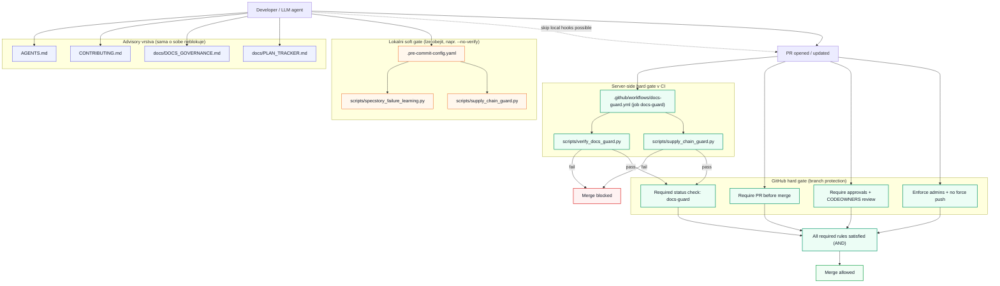

# As-Is Documentation Enforcement Flow (2026-04-01)

Doc-Meta:
- owner: engineering
- status: active
- last_updated_utc: 2026-04-01T19:03:45Z
- review_due_utc: 2026-04-15T00:00:00Z

## Co je hard vs soft
- Hard (nekompromisni): GitHub branch protection + required status check `docs-guard` + PR review pravidla.
- Soft (obejitelne): lokalni `.pre-commit` hooky a cteni instrukcnich dokumentu.
- Advisory: dokumentacni pravidla sama o sobe nic nezastavi, dokud nejsou navazana na hard gate.

