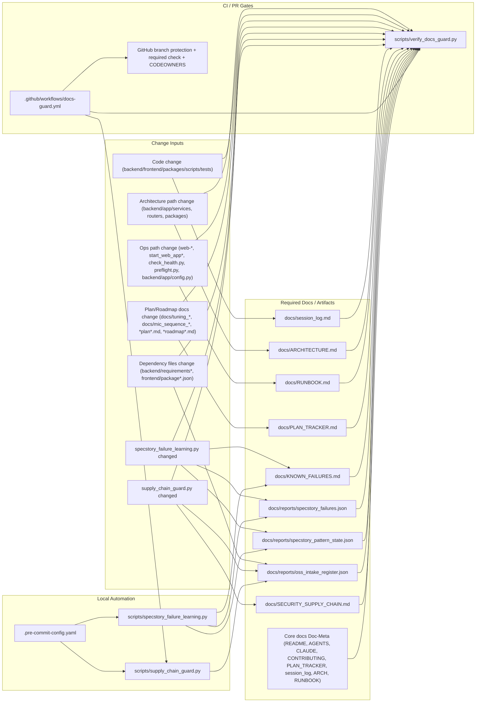

# As-Is Documentation Flow (2026-04-01)

Doc-Meta:
- owner: engineering
- status: active
- last_updated_utc: 2026-04-01T19:03:45Z
- review_due_utc: 2026-04-15T00:00:00Z

Pro enforcement pohled (hard vs soft gate) viz:
- `docs/as_is_documentation_enforcement_flow_2026-04-01.md`

