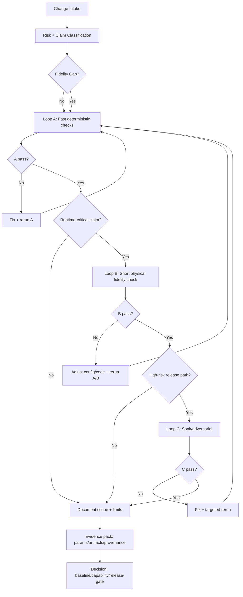
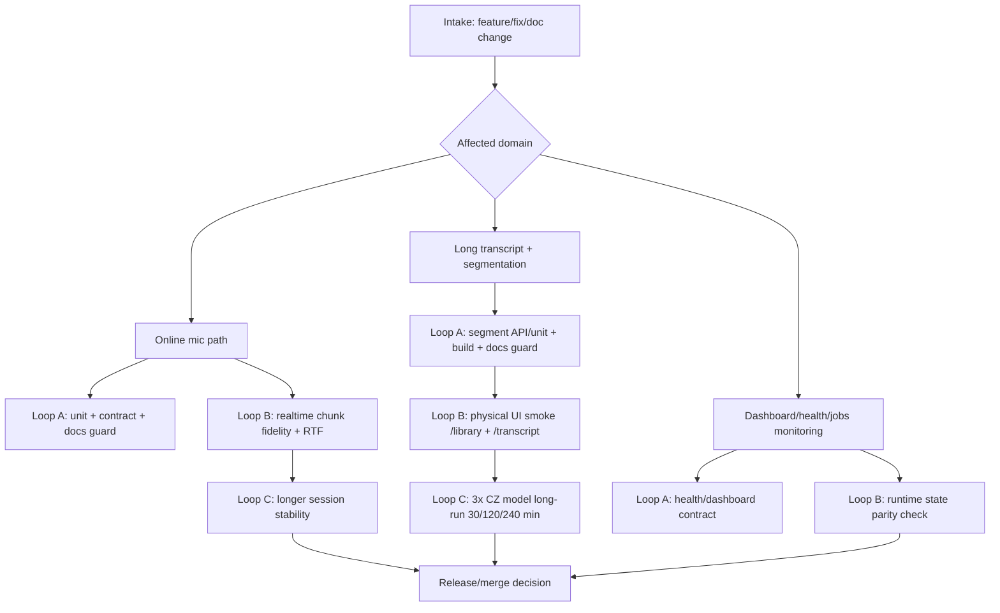

# Test Diagram Blueprint 2026-04-03

Doc-Meta:
- owner: engineering
- status: active
- doc_file: test_diagram_blueprint_2026-04-03.md
- last_updated_utc: 2026-04-03T12:00:26Z
- review_due_utc: 2026-04-15T00:00:00Z

## Ucel
- Dodat jasny podklad pro dva diagramy:
  1. obecny test model (platny napric domenami),
  2. konkretni test model pro aSTT-comp.
- Podklad je navrzen tak, aby po revizi slo rovnou vyrenderovat diagramy bez dalsi analyzy.

## Diagram A - Obecny test model (A/B/C loops + physical gate)

### Interpretace A
- Loop A je povinny vzdy (unit/integration/static/security checks).
- Loop B je povinny, pokud je runtime tvrzeni a existuje fidelity gap mezi simulaci a realitou.
- Loop C je povinny pro high-risk/release tvrzeni (stabilita, dlouhy beh, bezpecnostni odolnost).

## Diagram B - aSTT-comp konkretni test model

### Konkretny maping na V6 checkpointy (reuse, bez duplicity)
- V6 CP0-CP6 zustavaji canonical v `docs/tuning_v6_implementacni_plan.md`.
- Tento podklad je diagramova vrstva nad temito checkpointy:
  - CP0-CP2 ~ Loop A,
  - CP3-CP4 ~ Loop B,
  - CP5 ~ Loop C,
  - CP6 ~ release gate.

## Review checklist (pred push)
1. Souhlasi hranice mezi Loop A/B/C s realnou rizikovosti tvrzeni?
2. Je u aSTT-comp diagramu zachovana separace online mic vs transcript flow?
3. Je jasne, kdy je physical gate MUST a kdy je pouze doplnkovy?
4. Odpovida maping CP0-CP6 aktualnimu V6 planu?
